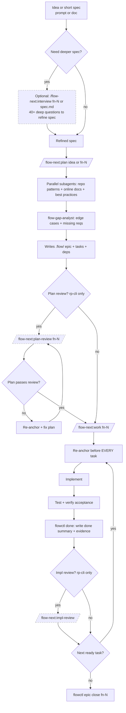

<div align="center">

# gmickel claude marketplace

[](LICENSE)
[](https://claude.ai/code)
[](plugins/flow-next/)
[](plugins/flow/)
[](https://mickel.tech)
[](https://twitter.com/gmickel)
[](https://github.com/sponsors/gmickel)

**Plugins that make AI agents actually work.**

</div>

---

## The Problem

Process failures, not model failures:

- Starting to code before understanding the codebase
- Reinventing patterns already there
- Forgetting the plan mid-implementation
- Skipping edge cases obvious in hindsight

This marketplace ships plugins that fix these problems.

---

## Plugins

| Plugin | What It Does |
|--------|--------------|
| [**flow-next**](#flow-next) | Plan-first workflow with `.flow/` task tracking. Zero deps. Multi-user safe. **Recommended.** |
| [**flow**](#flow) | Full-featured plan+work with optional Beads integration |

## Pick a plugin

- **flow-next**: `.flow/` + bundled `flowctl` + Ralph mode (autonomous overnight loop) via `/flow-next:ralph-init`
- **flow**: original behavior (plan files, optional external tracker)

---

## Flow-Next

> **Experimental.** Give it a spin. [Report issues.](https://github.com/gmickel/gmickel-claude-marketplace/issues)

**Plan first, work second. Zero external dependencies.**

```bash
/plugin install flow-next

/flow-next:plan Add a contact form with validation
/flow-next:work fn-1
```

Start with a short spec (prompt or file). If fuzzy, run `/flow-next:interview` first.

Agents that finish what they start.



📖 **Full guide (CLI, workflow, .flow layout):** [plugins/flow-next/README.md](plugins/flow-next/README.md)

<table>
<tr>
<td></td>
<td></td>
</tr>
<tr>
<td align="center"><em>Planning: dependency-ordered tasks</em></td>
<td align="center"><em>Execution: fixes, evidence, review</em></td>
</tr>
</table>

### Why I Built This

Agents forget, drift, and skip edge cases. Flow-Next fixes the process: task graphs, re-anchoring, evidence, cross-model review.

Instead of relying on external CLIs and config file edits, Flow-Next bundles a fully-featured task system in a single Python script. No npm packages. No daemons. No CLAUDE.md modifications. Try it in 30 seconds. Uninstall by deleting `.flow/` (and `scripts/ralph/` if enabled).

### Ralph (Autonomous Mode)

> **⚠️ Warning**: Ralph defaults to `YOLO=1` (skips permission prompts). Start with `ralph_once.sh` to observe a single iteration. Consider running in a [Docker sandbox](https://docs.docker.com/ai/sandboxes/claude-code/) for isolation.

**Setup (one-time, inside Claude):**
```bash
/flow-next:ralph-init
```

Or from terminal without entering Claude:
```bash
claude -p "/flow-next:ralph-init"
```

**Run (outside Claude):**
```bash
scripts/ralph/ralph.sh
```

**How Ralph differs from other autonomous agents:**

Most agents gate by tests alone. Ralph adds production-grade quality gates:

- **Multi-model reviews**: Uses [RepoPrompt](https://repoprompt.com/?atp=KJbuL4) to send code to a *different* model. Two models catch what one misses.
- **Review loops until SHIP**: Reviews block progress until `<verdict>SHIP</verdict>`. Fix → re-review cycles continue until approved.
- **Receipt-based gating**: Every review must produce a receipt JSON proving it ran. No receipt = no progress. Treats agent as untrusted actor; receipts are proof-of-work.

<details>
<summary><strong>📸 Ralph in action</strong> (click to expand)</summary>
<br>

</details>

📖 **[Ralph deep dive](plugins/flow-next/docs/ralph.md)**

### Features

| | |
|:--|:--|
| **Re-anchoring** | Before EVERY task, re-reads epic/task specs + git state. No drift. |
| **Multi-user safe** | Scan-based IDs. Soft claims via assignee. Actor auto-detect. |
| **Zero deps** | Bundled `flowctl.py`. No external CLI. Just Python 3. |
| **Non-invasive** | No daemons or CLAUDE.md edits. Delete `.flow/` (and `scripts/ralph/` if enabled) to uninstall. |
| **CI-ready** | `flowctl validate --all` exits 1 on errors. Drop into pre-commit or GitHub Actions. |
| **One file per task** | Merge-friendly. Conflict surface is minimal. |
| **Automated reviews** | Require [RepoPrompt](https://repoprompt.com/?atp=KJbuL4) (rp-cli). Without it, reviews are skipped. |
| **Dependency graphs** | Tasks declare blockers. Nothing starts until dependencies resolve. |

### Commands

| Command | What It Does |
|---------|--------------|
| `/flow-next:plan` | Research, create epic + tasks in `.flow/` |
| `/flow-next:work` | Execute epic end-to-end, task by task |
| `/flow-next:interview` | Deep interview to flesh out a spec |
| `/flow-next:plan-review` | Carmack-level plan review via rp-cli |
| `/flow-next:impl-review` | Carmack-level impl review (current branch) |
| `/flow-next:ralph-init` | Scaffold autonomous loop in `scripts/ralph/` |

### Autonomous Flags

All commands accept flags to bypass interactive questions:

```bash
# Interactive (asks questions)
/flow-next:plan Add caching
/flow-next:work fn-1

# Autonomous (flags)
/flow-next:plan Add caching --research=grep --no-review
/flow-next:work fn-1 --branch=current --no-review

# Autonomous (natural language)
/flow-next:plan Add caching, use context-scout, skip review
/flow-next:work fn-1 current branch, no review
```

📖 **[Full documentation](plugins/flow-next/README.md)**

---

## Install

```bash
/plugin marketplace add https://github.com/gmickel/gmickel-claude-marketplace
```

Then install whichever plugin you want:

```bash
/plugin install flow-next    # Recommended: zero deps, simpler
/plugin install flow         # If you use Beads or want plan files
```

---

## Flow

> **Requires RepoPrompt v1.5.62+** for review features.
> Using older RepoPrompt? Downgrade: `/plugin install flow@0.8.0`

**Plan first, work second.** The original, with optional Beads integration.

```bash
/plugin install flow

/flow:plan Add OAuth login for users
/flow:work plans/add-oauth-login.md
```

### How It Works

| Failure Mode | How Flow Fixes It |
|--------------|-------------------|
| Weak research | Parallel agents gather context *before* coding starts |
| Ignoring existing code | Explicit pattern reuse from your repo |
| Drifting from plan | Plan re-read between every task |
| Shallow self-review | Cross-model review via RepoPrompt |

### Commands

| Command | What It Does |
|---------|--------------|
| `/flow:plan` | Research + produce `plans/<slug>.md` |
| `/flow:work` | Execute plan end-to-end with task tracking |
| `/flow:interview` | Deep interview to flesh out spec/bead |
| `/flow:plan-review` | Carmack-level plan review via rp-cli |
| `/flow:impl-review` | Carmack-level impl review (current branch) |

### Integrations

- **[RepoPrompt](https://repoprompt.com/?atp=KJbuL4)** for token-efficient codebase exploration + cross-model reviews
- **[Beads](https://github.com/steveyegge/beads)** for dependency-aware issue tracking (auto-detected)

📖 **[Full documentation](plugins/flow/README.md)** · **[Changelog](CHANGELOG.md)**

---

## Also Check Out

> **[GNO](https://gno.sh)** — Local hybrid search for your notes, docs, and code. Give Claude Code long-term memory over your files via MCP.
>
> ```bash
> bun install -g @gmickel/gno && gno mcp install --target claude-code
> ```

---

## Contributing

1. Create `plugins/<name>/` with `.claude-plugin/plugin.json`
2. Add commands/agents/skills under that plugin root
3. Update `.claude-plugin/marketplace.json`
4. Validate: `jq . .claude-plugin/marketplace.json`

---

<div align="center">

Made by [Gordon Mickel](https://mickel.tech) · [@gmickel](https://twitter.com/gmickel) · [gordon@mickel.tech](mailto:gordon@mickel.tech)

[](https://github.com/sponsors/gmickel)

</div>
