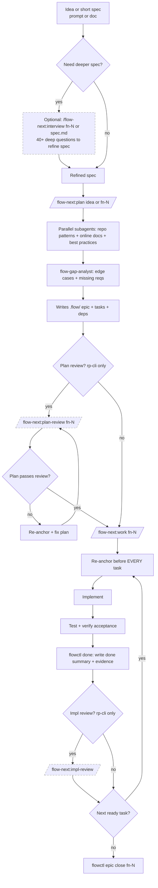

<div align="center">

# Flow-Next

[](../../LICENSE)
[](https://claude.ai/code)
[](../../CHANGELOG.md)
[]()

**Plan first, work second. Zero external dependencies.**

</div>

---

> **Experimental.** This plugin is under active development. Give it a spin and [report issues](https://github.com/gmickel/gmickel-claude-marketplace/issues).

---

## What Is This?

Flow-Next is a Claude Code plugin for plan-first orchestration. Bundled task tracking, dependency graphs, re-anchoring, and cross-model reviews.

Everything lives in a `.flow/` directory in your repo. No external services. No global config. Delete the folder to uninstall.

**Agents that finish what they start.**

<table>
<tr>
<td></td>
<td></td>
</tr>
<tr>
<td align="center"><em>Planning: dependency-ordered tasks</em></td>
<td align="center"><em>Execution: fixes, evidence, review</em></td>
</tr>
</table>

---

## Epic-first task model

Flow-Next does not support standalone tasks.

Every unit of work belongs to an epic fn-N (even if it's a single task).

Tasks are always fn-N.M and inherit context from the epic spec.

Flow-Next always creates an epic container (even for one-offs) so every task has a durable home for context, re-anchoring, and automation. You never have to think about it.

Rationale: keeps the system simple, improves re-anchoring, makes automation (Ralph) reliable.

"One-off request" -> epic with one task.

---

## Why I Built This

Process failures, not model failures.

- Forgetting the plan mid-implementation
- Losing context in long sessions
- Drifting from original intent
- Skipping edge cases obvious in hindsight

Flow-Next gives agents structured task graphs, forces re-anchoring before every task, records evidence of completion, and runs cross-model reviews.

Instead of relying on external CLIs and config file edits, Flow-Next bundles a fully-featured task system in a single Python script:

- **Works in 30 seconds.** Install the plugin, run a command. No setup.
- **Non-invasive.** No CLAUDE.md edits. No hooks. No daemons.
- **Clean uninstall.** Delete `.flow/` and it's gone. No traces.
- **Multi-user safe.** Teams work parallel branches without coordination servers.

---

## Install

```bash
/plugin marketplace add https://github.com/gmickel/gmickel-claude-marketplace
/plugin install flow-next
```

Try it in ~30 seconds. Uninstall with `rm -rf .flow/`.

---

## Quick Start

```bash
# 1. Plan: research, create epic with tasks
/flow-next:plan Add a contact form with validation

# 2. Work: execute tasks in dependency order
/flow-next:work fn-1
```

This creates an epic (fn-N) even for small requests, then breaks it into tasks.

Start with a short spec (prompt or file). If fuzzy, run `/flow-next:interview` first.

That's it. Flow-Next handles research, task ordering, reviews, and audit trails.

---

## Human-in-the-Loop Workflow (Detailed)

Full autonomous "Ralph" coming soon. For now, this is the human-in-the-loop flow:



Notes:
- `/flow-next:interview` accepts Flow IDs or spec file paths and writes refinements back
- `/flow-next:plan` accepts new ideas or an existing Flow ID to update the plan

Recommendation: open RepoPrompt in the repo before starting a new flow so plan/impl reviews have fast context.

---

## Features

Built for reliability. These are the guardrails.

### Re-anchoring

Before EVERY task, Flow-Next re-reads:
- Epic spec and task spec from `.flow/`
- Current git status and recent commits
- Validation state

Per Anthropic's long-running agent guidance: agents must re-anchor from sources of truth to prevent drift. The reads are cheap; drift is expensive.

### Multi-user Safe

Teams can work in parallel branches without coordination servers:

- **Merge-safe IDs**: Scans existing files to allocate the next ID. No shared counters.
- **Soft claims**: Tasks track an `assignee` field. Prevents accidental duplicate work.
- **Actor resolution**: Auto-detects from git email, `FLOW_ACTOR` env, or `$USER`.
- **Local validation**: `flowctl validate --all` catches issues before commit.

```bash
# Actor A starts task
flowctl start fn-1.1   # Sets assignee automatically

# Actor B tries same task
flowctl start fn-1.1   # Fails: "claimed by actor-a@example.com"
flowctl start fn-1.1 --force  # Override if needed
```

### Zero Dependencies

Everything is bundled:
- `flowctl.py` ships with the plugin
- No Beads CLI to install
- No external services
- Just Python 3

### Non-invasive

- No hooks
- No daemons
- No CLAUDE.md edits
- Delete `.flow/` to uninstall completely

### CI-ready

```bash
flowctl validate --all
```

Exits 1 on errors. Drop into pre-commit hooks or GitHub Actions. See `docs/ci-workflow-example.yml`.

### One File Per Task

Each epic and task gets its own JSON + markdown file pair. Merge conflicts are rare and easy to resolve.

### Automated Reviews

Reviews require [rp-cli](https://repoprompt.com) ([RepoPrompt](https://repoprompt.com)). Without it, review steps are skipped. Cross-model review catches blind spots.

### Dependency Graphs

Tasks declare their blockers. `flowctl ready` shows what can start. Nothing executes until dependencies resolve.

---

## Commands

Five commands, complete workflow:

| Command | What It Does |
|---------|--------------|
| `/flow-next:plan <idea>` | Research the codebase, create epic with dependency-ordered tasks |
| `/flow-next:work <id>` | Execute epic or single task, re-anchoring before each |
| `/flow-next:interview <id>` | Deep interview to flesh out a spec before planning |
| `/flow-next:plan-review <id>` | Carmack-level plan review via rp-cli |
| `/flow-next:impl-review` | Carmack-level impl review of current branch |

Work accepts an epic (fn-N) or a task (fn-N.M). Tasks always belong to an epic.

### Autonomous Mode (Flags)

All commands accept flags to skip questions:

```bash
# Plan with flags
/flow-next:plan Add caching --research=grep --no-review
/flow-next:plan Add auth --research=rp --review=rp

# Work with flags
/flow-next:work fn-1 --branch=current --no-review
/flow-next:work fn-1 --branch=new --review=export

# Reviews with flags
/flow-next:plan-review fn-1 --mode=rp
/flow-next:impl-review --mode=export
```

Natural language also works:

```bash
/flow-next:plan Add webhooks, use context-scout, skip review
/flow-next:work fn-1 current branch, no review
```

| Command | Available Flags |
|---------|-----------------|
| `/flow-next:plan` | `--research=rp\|grep`, `--review=rp\|export\|none`, `--no-review` |
| `/flow-next:work` | `--branch=current\|new\|worktree`, `--review=rp\|export\|none`, `--no-review` |
| `/flow-next:plan-review` | `--mode=rp\|export` |
| `/flow-next:impl-review` | `--mode=rp\|export` |

---

## The Workflow

### Planning Phase

1. **Research (parallel subagents)**: `repo-scout` (or `context-scout` if rp-cli) + `practice-scout` + `docs-scout`
2. **Gap analysis**: `flow-gap-analyst` finds edge cases + missing requirements
3. **Epic creation**: Writes spec to `.flow/specs/fn-N.md`
4. **Task breakdown**: Creates tasks + explicit dependencies in `.flow/tasks/`
5. **Validate**: `flowctl validate --epic fn-N`
6. **Review** (optional): `/flow-next:plan-review fn-N` with re-anchor + fix loop until "Ship"

### Work Phase

1. **Re-anchor**: Re-read epic + task specs + git state (EVERY task)
2. **Execute**: Implement using existing patterns
3. **Test**: Verify acceptance criteria
4. **Record**: `flowctl done` adds summary + evidence to the task spec
5. **Review** (optional): `/flow-next:impl-review` via RepoPrompt
6. **Loop**: Next ready task → repeat until epic closes

---

## .flow/ Directory

```
.flow/
├── meta.json              # Schema version
├── epics/
│   └── fn-1.json          # Epic metadata (id, title, status)
├── specs/
│   └── fn-1.md            # Epic spec (plan, scope, acceptance)
├── tasks/
│   ├── fn-1.1.json        # Task metadata (id, status, deps, assignee)
│   ├── fn-1.1.md          # Task spec (description, acceptance, done summary)
│   └── ...
└── memory/                # Reserved for future context features
```

### ID Format

- **Epic**: `fn-N` (e.g., `fn-1`, `fn-42`)
- **Task**: `fn-N.M` (e.g., `fn-1.1`, `fn-42.7`)

There are no task IDs outside an epic. If you want a single task, create an epic with one task.

### Separation of Concerns

- **JSON files**: Metadata only (IDs, status, dependencies, assignee)
- **Markdown files**: Narrative content (specs, descriptions, summaries)

---

## flowctl CLI

Bundled Python script for managing `.flow/`. Skills call this automatically, but you can use it directly:

```bash
# Setup
flowctl init                              # Create .flow/ structure
flowctl detect                            # Check if .flow/ exists

# Epics
flowctl epic create --title "..."         # Create epic
flowctl epic set-plan fn-1 --file spec.md # Set epic spec from file
flowctl epic close fn-1                   # Close epic (requires all tasks done)

# Tasks
flowctl task create --epic fn-1 --title "..." --deps fn-1.2,fn-1.3
flowctl task set-description fn-1.1 --file desc.md
flowctl task set-acceptance fn-1.1 --file accept.md

# Dependencies
flowctl dep add fn-1.3 fn-1.2             # fn-1.3 depends on fn-1.2

# Workflow
flowctl ready --epic fn-1                 # Show ready/in_progress/blocked
flowctl start fn-1.1                      # Claim and start task
flowctl done fn-1.1 --summary-file s.md --evidence-json e.json

# Queries
flowctl show fn-1 --json                  # Epic with all tasks
flowctl cat fn-1                          # Print epic spec

# Validation
flowctl validate --epic fn-1              # Validate single epic
flowctl validate --all                    # Validate everything (for CI)

# Review helpers
flowctl prep-chat --message-file m.md --selected-paths a.ts b.ts -o payload.json
```

📖 **[Full CLI reference](docs/flowctl.md)**

---

## Task Completion

When a task completes, `flowctl done` appends structured data to the task spec:

### Done Summary

```markdown
## Done summary

- Added ContactForm component with Zod validation
- Integrated with server action for submission
- All tests passing

Follow-ups:
- Consider rate limiting (out of scope)
```

### Evidence

```markdown
## Evidence

{"commits":["a3f21b9"],"tests":["bun test"],"prs":[]}
```

This creates a complete audit trail: what was planned, what was done, how it was verified.

---

## Flow vs Flow-Next

| | Flow | Flow-Next |
|:--|:--|:--|
| **Task tracking** | Beads CLI or standalone plan files | `.flow/` directory (bundled flowctl) |
| **Install** | Plugin + optionally Beads | Plugin only |
| **Artifacts** | `plans/<slug>.md` | `.flow/specs/` and `.flow/tasks/` |
| **Config edits** | CLAUDE.md (for Beads) | None |
| **Multi-user** | Via Beads | Built-in (scan-based IDs, soft claims) |
| **Uninstall** | Remove plugin + Beads config | Delete `.flow/` folder |

**Choose Flow-Next if you want:**
- Zero external dependencies
- No config file edits
- Clean uninstall (just delete `.flow/`)
- Built-in multi-user safety

**Choose Flow if you:**
- Already use Beads for issue tracking
- Want plan files as standalone artifacts
- Need Beads' full issue management features

---

## Requirements

- Python 3.8+
- git
- [rp-cli](https://repoprompt.com) ([RepoPrompt](https://repoprompt.com)) — optional but highly recommended. Enables the entire review flow: AI-powered context building, cross-model plan reviews, and implementation reviews using a separate model. Without it, reviews are skipped.

---

## Development

```bash
claude --plugin-dir ./plugins/flow-next
```

---

## Other Platforms

### OpenAI Codex (Experimental)

Flow-Next partially works in OpenAI Codex with some limitations:

**Caveats:**
- No subagent support (research scouts run inline or are skipped)

**Install:**
```bash
./scripts/install-codex.sh flow-next
```

---

<div align="center">

Made by [Gordon Mickel](https://mickel.tech) · [@gmickel](https://twitter.com/gmickel)

</div>
