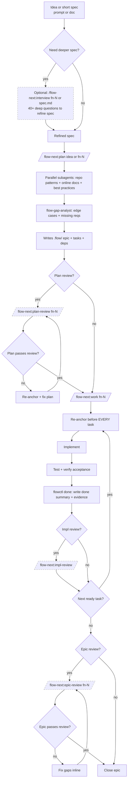
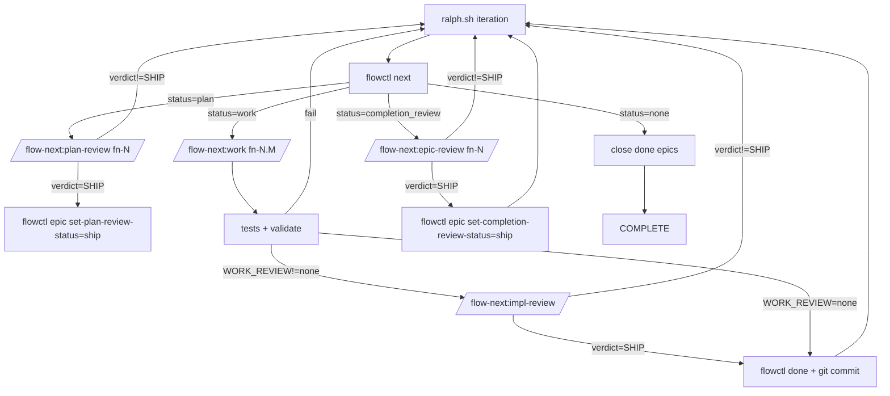

<div align="center">

# Flow-Next

[](../../LICENSE)
[](https://claude.ai/code)

[](../../CHANGELOG.md)

[](../../CHANGELOG.md)
[](https://discord.gg/nHEmyJB5tg)

**Plan first, work second. Zero external dependencies.**

</div>

---

> **Active development.** [Changelog](../../CHANGELOG.md) | [Report issues](https://github.com/gmickel/gmickel-claude-marketplace/issues)

🌐 **Prefer a visual overview?** See the [Flow-Next app page](https://mickel.tech/apps/flow-next) for diagrams and examples.

> **New: Codex Review Backend.** Cross-model reviews now work on Linux/Windows via OpenAI Codex CLI. Same Carmack-level criteria as RepoPrompt. See [Cross-Model Reviews](#cross-model-reviews) for setup.

---

## Table of Contents

- [What Is This?](#what-is-this)
- [Why It Works](#why-it-works)
- [Quick Start](#quick-start) — Install, setup, use
- [When to Use What](#when-to-use-what) — Interview vs Plan vs Work
- [Agent Readiness Assessment](#agent-readiness-assessment) — `/flow-next:prime`
- [Troubleshooting](#troubleshooting)
- [Ralph (Autonomous Mode)](#ralph-autonomous-mode) — Run overnight
- [Features](#features) — Re-anchoring, multi-user, reviews, dependencies
- [Commands](#commands) — All slash commands + flags
  - [Command Reference](#command-reference) — Detailed input docs for each command
- [The Workflow](#the-workflow) — Planning and work phases
- [.flow/ Directory](#flow-directory) — File structure
- [flowctl CLI](#flowctl-cli) — Direct CLI usage

---

## What Is This?

Flow-Next is a Claude Code plugin for plan-first orchestration. Bundled task tracking, dependency graphs, re-anchoring, and cross-model reviews.

Everything lives in your repo. No external services. No global config. Uninstall: delete `.flow/` (and `scripts/ralph/` if enabled).

<table>
<tr>
<td></td>
<td></td>
</tr>
<tr>
<td align="center"><em>Planning: dependency-ordered tasks</em></td>
<td align="center"><em>Execution: fixes, evidence, review</em></td>
</tr>
</table>

---

## Epic-first task model

Flow-Next does not support standalone tasks.

Every unit of work belongs to an epic fn-N (even if it's a single task).

Tasks are always fn-N.M and inherit context from the epic spec.

Flow-Next always creates an epic container (even for one-offs) so every task has a durable home for context, re-anchoring, and automation. You never have to think about it.

Rationale: keeps the system simple, improves re-anchoring, makes automation (Ralph) reliable.

"One-off request" -> epic with one task.

---

## Why It Works

### You Control the Granularity

Work task-by-task with full review cycles for maximum control. Or throw the whole epic at it and let Flow-Next handle everything. Same guarantees either way.

```bash
# One task at a time (review after each)
/flow-next:work fn-1.1

# Entire epic (review after all tasks complete)
/flow-next:work fn-1
```

Both get: re-anchoring before each task, evidence recording, cross-model review (if rp-cli available).

**Review timing**: The RepoPrompt review runs once at the end of the work package—after a single task if you specified `fn-N.M`, or after all tasks if you specified `fn-N`. For tighter review loops on large epics, work task-by-task.

### No Context Length Worries

- **Tasks sized at planning:** Every task is scoped to fit one work iteration
- **Re-anchor every task:** Fresh context from `.flow/` specs before each task
- **Survives compaction:** Re-anchors after conversation summarization too
- **Fresh context in Ralph:** Each iteration starts with a clean context window

Never worry about 200K token limits again.

### Reviewer as Safety Net

If drift happens despite re-anchoring, a different model catches it before it compounds:

1. Claude implements task
2. GPT reviews via RepoPrompt (sees full files, not diffs)
3. Reviews block until `SHIP` verdict
4. Fix → re-review cycles continue until approved

Two models catch what one misses.

---

### Zero Friction

- **Works in 30 seconds.** Install the plugin, run a command. No setup.
- **Non-invasive.** No CLAUDE.md edits. No daemons. (Ralph uses plugin hooks for enforcement.)
- **Clean uninstall.** Delete `.flow/` (and `scripts/ralph/` if enabled).
- **Multi-user safe.** Teams work parallel branches without coordination servers.

---

## Quick Start

### 1. Install

```bash
# Add marketplace
/plugin marketplace add https://github.com/gmickel/gmickel-claude-marketplace

# Install flow-next
/plugin install flow-next
```

### 2. Setup (Recommended)

```bash
/flow-next:setup
```

This is technically optional but **highly recommended**. It:
- **Configures review backend** (RepoPrompt, Codex, or none) — required for cross-model reviews
- Copies `flowctl` to `.flow/bin/` for direct CLI access
- Adds flow-next instructions to CLAUDE.md/AGENTS.md (helps other AI tools understand your project)
- Creates `.flow/usage.md` with full CLI reference

**Idempotent** - safe to re-run. Detects plugin updates and refreshes scripts automatically.

After setup:
```bash
export PATH=".flow/bin:$PATH"
flowctl --help
flowctl epics                # List all epics
flowctl tasks --epic fn-1    # List tasks for epic
flowctl ready --epic fn-1    # What's ready to work on
```

### 3. Use

```bash
# Plan: research, create epic with tasks
/flow-next:plan Add a contact form with validation

# Work: execute tasks in dependency order
/flow-next:work fn-1

# Or work directly from a spec file (creates epic automatically)
/flow-next:work docs/my-feature-spec.md
```

That's it. Flow-Next handles research, task ordering, reviews, and audit trails.

### When to Use What

Flow-next is flexible. There's no single "correct" order — the right sequence depends on how well-defined your spec already is.

**The key question: How fleshed out is your idea?**

#### Vague idea or rough concept

```
Interview → Plan → Work
```

1. **Interview first** — `/flow-next:interview "your rough idea"` asks 40+ deep questions to surface requirements, edge cases, and decisions you haven't thought about
2. **Plan** — `/flow-next:plan fn-1` takes the refined spec and researches best practices, current docs, repo patterns, then splits into properly-sized tasks
3. **Work** — `/flow-next:work fn-1` executes with re-anchoring and reviews

#### Well-written spec or PRD

```
Plan → Interview → Work
```

1. **Plan first** — `/flow-next:plan specs/my-feature.md` researches best practices and current patterns, then breaks your spec into epic + tasks
2. **Interview after** — `/flow-next:interview fn-1` runs deep questions against the plan to catch edge cases, missing requirements, or assumptions
3. **Work** — `/flow-next:work fn-1` executes

#### Minimal planning

```
Plan → Work
```

Skip interview entirely for well-understood changes. Plan still researches best practices and splits into tasks.

#### Quick single-task (spec already complete)

```
Work directly
```

```bash
/flow-next:work specs/small-fix.md
```

For small, self-contained changes where you already have a complete spec. Creates an epic with **one task** and executes immediately. You get flow tracking, re-anchoring, and optional review — without full planning overhead.

Best for: bug fixes, small features, well-scoped changes that don't need task splitting.

**Note:** This does NOT split into multiple tasks. For detailed specs that need breakdown, use Plan first.

**Summary:**

| Starting point | Recommended sequence |
|----------------|---------------------|
| Vague idea, rough notes | Interview → Plan → Work |
| Detailed spec/PRD | Plan → Interview → Work |
| Well-understood, needs task splitting | Plan → Work |
| Small single-task, spec complete | Work directly (creates 1 epic + 1 task) |

**Interview vs Plan boundary:**
- **Interview** creates an epic with refined requirements (problem, decisions, edge cases). It does NOT create tasks or research the codebase.
- **Plan** researches best practices, analyzes existing patterns, and creates sized tasks with dependencies.

You can always run interview again after planning to catch anything missed. Interview writes back to the epic spec only — it won't modify existing tasks.

---

## Agent Readiness Assessment

> Inspired by [Factory.ai's Agent Readiness framework](https://factory.ai/news/agent-readiness)

`/flow-next:prime` assesses your codebase for agent-readiness and proposes improvements. Works for greenfield and brownfield projects.

### The Problem

Agents waste cycles when codebases lack:
- **Pre-commit hooks** → waits 10min for CI instead of 5sec local feedback
- **Documented env vars** → guesses, fails, guesses again
- **CLAUDE.md** → doesn't know project conventions
- **Test commands** → can't verify changes work

These are **environment problems**, not agent problems. Prime helps fix them.

### Quick Start

```bash
/flow-next:prime                 # Full assessment + interactive fixes
/flow-next:prime --report-only   # Just show the report
/flow-next:prime --fix-all       # Apply all fixes without asking
```

### The Eight Pillars

Prime evaluates your codebase across eight pillars (48 criteria total):

#### Agent Readiness (Pillars 1-5) — Scored, Fixes Offered

| Pillar | What It Checks |
|--------|----------------|
| **1. Style & Validation** | Linters, formatters, type checking, pre-commit hooks |
| **2. Build System** | Build tool, commands, lock files, monorepo tooling |
| **3. Testing** | Test framework, commands, verification, coverage, E2E |
| **4. Documentation** | README, CLAUDE.md, setup docs, architecture |
| **5. Dev Environment** | .env.example, Docker, devcontainer, runtime version |

#### Production Readiness (Pillars 6-8) — Reported Only

| Pillar | What It Checks |
|--------|----------------|
| **6. Observability** | Structured logging, tracing, metrics, error tracking, health endpoints |
| **7. Security** | Branch protection, secret scanning, CODEOWNERS, Dependabot |
| **8. Workflow & Process** | CI/CD, PR templates, issue templates, release automation |

**Two-tier approach**: Pillars 1-5 determine your agent maturity level and are eligible for fixes. Pillars 6-8 are reported for visibility but no fixes are offered — these are team/production decisions.

### Maturity Levels

| Level | Name | Description | Overall Score |
|-------|------|-------------|---------------|
| 1 | Minimal | Basic project structure only | <30% |
| 2 | Functional | Can build and run, limited docs | 30-49% |
| 3 | **Standardized** | Agent-ready for routine work | 50-69% |
| 4 | Optimized | Fast feedback loops, comprehensive docs | 70-84% |
| 5 | Autonomous | Full autonomous operation capable | 85%+ |

**Level 3 is the target** for most teams. It means agents can handle routine work: bug fixes, tests, docs, dependency updates.

### How It Works

1. **Parallel Assessment** — 9 haiku scouts run in parallel (~15-20 seconds):

   Agent Readiness scouts:
   - `tooling-scout` — linters, formatters, pre-commit, type checking
   - `claude-md-scout` — CLAUDE.md/AGENTS.md analysis
   - `env-scout` — environment setup
   - `testing-scout` — test infrastructure
   - `build-scout` — build system
   - `docs-gap-scout` — README, ADRs, architecture docs

   Production Readiness scouts:
   - `observability-scout` — logging, tracing, metrics, health endpoints
   - `security-scout` — GitHub API checks, CODEOWNERS, Dependabot
   - `workflow-scout` — CI/CD, templates, automation

2. **Verification** — Verifies test commands actually work (e.g., `pytest --collect-only`)

3. **Synthesize Report** — Calculates Agent Readiness score, Production Readiness score, and maturity level

4. **Interactive Remediation** — Uses `AskUserQuestion` for agent readiness fixes only:
   ```
   Which tooling improvements should I add?
   ☐ Add pre-commit hooks (Recommended)
   ☐ Add linter config
   ☐ Add runtime version file
   ```

5. **Apply Fixes** — Creates/modifies files based on your selections

6. **Re-assess** — Optionally re-run to show improvement

### Example Report

```markdown
# Agent Readiness Report

**Repository**: my-project
**Assessed**: 2026-01-23

## Scores Summary

| Category | Score | Level |
|----------|-------|-------|
| **Agent Readiness** (Pillars 1-5) | 73% | Level 4 - Optimized |
| Production Readiness (Pillars 6-8) | 17% | — |
| **Overall** | 52% | — |

## Agent Readiness (Pillars 1-5)

| Pillar | Score | Status |
|--------|-------|--------|
| Style & Validation | 67% (4/6) | ⚠️ |
| Build System | 100% (6/6) | ✅ |
| Testing | 67% (4/6) | ⚠️ |
| Documentation | 83% (5/6) | ✅ |
| Dev Environment | 83% (5/6) | ✅ |

## Production Readiness (Pillars 6-8) — Report Only

| Pillar | Score | Status |
|--------|-------|--------|
| Observability | 33% (2/6) | ❌ |
| Security | 17% (1/6) | ❌ |
| Workflow & Process | 0% (0/6) | ❌ |

## Top Recommendations (Agent Readiness)

1. **Tooling**: Add pre-commit hooks — 5 sec feedback vs 10 min CI wait
2. **Tooling**: Add Python type checking — catch errors locally
3. **Docs**: Update README — replace generic template
```

### Remediation Templates

Prime offers fixes for agent readiness gaps (**not** team governance):

| Fix | What Gets Created |
|-----|-------------------|
| CLAUDE.md | Project overview, commands, structure, conventions |
| .env.example | Template with detected env vars |
| Pre-commit (JS) | Husky + lint-staged config |
| Pre-commit (Python) | `.pre-commit-config.yaml` |
| Linter config | ESLint, Biome, or Ruff config (if none exists) |
| Formatter config | Prettier or Biome config (if none exists) |
| .nvmrc/.python-version | Runtime version pinning |
| .gitignore entries | .env, build outputs, node_modules |

Templates adapt to your project's detected conventions and existing tools. Won't suggest ESLint if you have Biome, etc.

### User Consent Required

**By default, prime asks before every change** using interactive checkboxes. You choose what gets created.

- **Asks first** — uses `AskUserQuestion` tool for interactive selection per category
- **Never overwrites** existing files without explicit consent
- **Never commits** changes (leaves for you to review)
- **Never deletes** files
- **Merges** with existing configs when possible
- **Respects** your existing tools (won't add ESLint if you have Biome)

Use `--fix-all` to skip questions and apply everything. Use `--report-only` to just see the assessment.

### Flags

| Flag | Description |
|------|-------------|
| `--report-only` | Skip remediation, just show report |
| `--fix-all` | Apply all recommendations without asking |
| `<path>` | Assess a different directory |

---

### Interactive vs Autonomous (The Handoff)

After planning completes, you choose how to execute:

| Mode | Command | When to Use |
|------|---------|-------------|
| **Interactive** | `/flow-next:work fn-1` | Complex tasks, learning a codebase, taste matters, want to intervene |
| **Autonomous (Ralph)** | `scripts/ralph/ralph.sh` | Clear specs, bulk implementation, overnight runs |

**The heuristic:** If you can write checkboxes, you can Ralph it. If you can't, you're not ready to loop—you're ready to think.

For full autonomous mode, prepare 5-10 plans before starting Ralph. See [Ralph Mode](#ralph-autonomous-mode) for setup.

> 📖 Deep dive: [Ralph Mode: Why AI Agents Should Forget](https://medium.com/byte-sized-brainwaves/ralph-mode-why-ai-agents-should-forget-9f98bec6fc91)

---

## Troubleshooting

### Reset a stuck task

```bash
# Check task status
flowctl show fn-1.2 --json

# Reset to todo (from done/blocked)
flowctl task reset fn-1.2

# Reset + dependents in same epic
flowctl task reset fn-1.2 --cascade
```

### Clean up `.flow/` safely

Run manually in terminal (not via AI agent):

```bash
# Remove all flow state (keeps git history)
rm -rf .flow/

# Re-initialize
flowctl init
```

### Debug Ralph runs

```bash
# Check run progress
cat scripts/ralph/runs/*/progress.txt

# View iteration logs
ls scripts/ralph/runs/*/iter-*.log

# Check for blocked tasks
ls scripts/ralph/runs/*/block-*.md
```

### Receipt validation failing

```bash
# Check receipt exists
ls scripts/ralph/runs/*/receipts/

# Verify receipt format
cat scripts/ralph/runs/*/receipts/impl-fn-1.1.json
# Must have: {"type":"impl_review","id":"fn-1.1",...}
```

### Custom rp-cli instructions conflicting

> **Caution**: If you have custom instructions for `rp-cli` in your `CLAUDE.md` or `AGENTS.md`, they may conflict with Flow-Next's RepoPrompt integration.

Flow-Next's plan-review and impl-review skills include specific instructions for `rp-cli` usage (window selection, builder workflow, chat commands). Custom rp-cli instructions can override these and cause unexpected behavior.

**Symptoms:**
- Reviews not using the correct RepoPrompt window
- Builder not selecting expected files
- Chat commands failing or behaving differently

**Fix:** Remove or comment out custom rp-cli instructions from your `CLAUDE.md`/`AGENTS.md` when using Flow-Next reviews. The plugin provides complete rp-cli guidance.

---

## Uninstall

Run manually in terminal (DCG blocks these from AI agents):

```bash
rm -rf .flow/               # Core flow state
rm -rf scripts/ralph/       # Ralph (if enabled)
```

Or use `/flow-next:uninstall` which cleans up docs and prints commands to run.

---

## Ralph (Autonomous Mode)

> **⚠️ Safety first**: Ralph defaults to `YOLO=1` (skips permission prompts).
> - Start with `ralph_once.sh` to observe one iteration
> - Consider [Docker sandbox](https://docs.docker.com/ai/sandboxes/claude-code/) for isolation
> - Consider [DCG (Destructive Command Guard)](https://github.com/Dicklesworthstone/destructive_command_guard) to block destructive commands — see [DCG setup](docs/ralph.md#additional-safety-dcg-optional)
>
> **Community sandbox setups** (alternative approaches):
> - [devcontainer-for-claude-yolo-and-flow-next](https://github.com/Ranudar/devcontainer-for-claude-yolo-and-flow-next) — VS Code devcontainer with Playwright, firewall whitelisting, and RepoPrompt MCP bridge
> - [agent-sandbox](https://github.com/novotnyllc/agent-sandbox) — Docker Sandbox (Desktop 4.50+) with seccomp/user namespace isolation, .NET + Node.js

Ralph is the repo-local autonomous loop that plans and works through tasks end-to-end.

**Setup (one-time, inside Claude):**
```bash
/flow-next:ralph-init
```

Or from terminal without entering Claude:
```bash
claude -p "/flow-next:ralph-init"
```

**Run (outside Claude):**
```bash
scripts/ralph/ralph.sh
```

Ralph writes run artifacts under `scripts/ralph/runs/`, including review receipts used for gating.

📖 **[Ralph deep dive](docs/ralph.md)**

🖥️ **[Ralph TUI](../../flow-next-tui/)** — Terminal UI for monitoring runs in real-time (`bun add -g @gmickel/flow-next-tui`)

### How Ralph Differs from Other Autonomous Agents

Autonomous coding agents are taking the industry by storm—loop until done, commit, repeat. Most solutions gate progress by tests and linting alone. Ralph goes further.

**Multi-model review gates**: Ralph uses [RepoPrompt](https://repoprompt.com/?atp=KJbuL4) (macOS) or OpenAI Codex CLI (cross-platform) to send plan and implementation reviews to a *different* model. A second set of eyes catches blind spots that self-review misses. RepoPrompt's builder provides full file context; Codex uses context hints from changed files.

**Review loops until Ship**: Reviews don't just flag issues—they block progress until resolved. Ralph runs fix → re-review cycles until the reviewer returns `<verdict>SHIP</verdict>`. No "LGTM with nits" that get ignored.

**Receipt-based gating**: Reviews must produce a receipt JSON file proving they ran. No receipt = no progress. This prevents drift where Claude skips the review step and marks things done anyway.

**Guard hooks**: Plugin hooks enforce workflow rules deterministically—blocking `--json` flags, preventing new chats on re-reviews, requiring receipts before stop. Only active when `FLOW_RALPH=1`; zero impact for non-Ralph users. See [Guard Hooks](docs/ralph.md#guard-hooks).

**Atomic window selection**: The `setup-review` command handles RepoPrompt window matching atomically. Claude can't skip steps or invent window IDs—the entire sequence runs as one unit or fails.

The result: code that's been reviewed by two models, tested, linted, and iteratively refined. Not perfect, but meaningfully more robust than single-model autonomous loops.

### Controlling Ralph

External agents (Clawdbot, GitHub Actions, etc.) can pause/resume/stop Ralph runs without killing processes.

**CLI commands:**
```bash
# Check status
flowctl status                    # Epic/task counts + active runs
flowctl status --json             # JSON for automation

# Control active run
flowctl ralph pause               # Pause run (auto-detects if single)
flowctl ralph resume              # Resume paused run
flowctl ralph stop                # Request graceful stop
flowctl ralph status              # Show run state

# Specify run when multiple active
flowctl ralph pause --run <id>
```

**Sentinel files (manual control):**
```bash
# Pause: touch PAUSE file in run directory
touch scripts/ralph/runs/<run-id>/PAUSE
# Resume: remove PAUSE file
rm scripts/ralph/runs/<run-id>/PAUSE
# Stop: touch STOP file (kept for audit)
touch scripts/ralph/runs/<run-id>/STOP
```

Ralph checks sentinels at iteration boundaries (after Claude returns, before next iteration).

**Task retry/rollback:**
```bash
# Reset completed/blocked task to todo
flowctl task reset fn-1-add-oauth.3

# Reset + cascade to dependent tasks (same epic)
flowctl task reset fn-1-add-oauth.2 --cascade
```

---

## Human-in-the-Loop Workflow (Detailed)

Default flow when you drive manually:



Notes:
- `/flow-next:interview` accepts Flow IDs or spec file paths and writes refinements back
- `/flow-next:plan` accepts new ideas or an existing Flow ID to update the plan

Tip: with RP 1.5.68+, use `flowctl rp setup-review --create` to auto-open RepoPrompt windows. Alternatively, open RP on your repo beforehand for faster context loading.
Plan review in rp mode requires `flowctl rp chat-send`; if rp-cli/windows unavailable, the review gate retries.

---

## Features

Built for reliability. These are the guardrails.

**Re-anchoring prevents drift**

Before EVERY task, Flow-Next re-reads the epic spec, task spec, and git state from `.flow/`. This forces Claude back to the source of truth - no hallucinated scope creep, no forgotten requirements. In Ralph mode, this happens automatically each iteration.

Unlike agents that carry accumulated context (where early mistakes compound), re-anchoring gives each task a fresh, accurate starting point.

### Re-anchoring

Before EVERY task, Flow-Next re-reads:
- Epic spec and task spec from `.flow/`
- Current git status and recent commits
- Validation state

Per Anthropic's long-running agent guidance: agents must re-anchor from sources of truth to prevent drift. The reads are cheap; drift is expensive.

### Multi-user Safe

Teams can work in parallel branches without coordination servers:

- **Merge-safe IDs**: Scans existing files to allocate the next ID. No shared counters.
- **Soft claims**: Tasks track an `assignee` field. Prevents accidental duplicate work.
- **Actor resolution**: Auto-detects from git email, `FLOW_ACTOR` env, or `$USER`.
- **Local validation**: `flowctl validate --all` catches issues before commit.

```bash
# Actor A starts task
flowctl start fn-1.1   # Sets assignee automatically

# Actor B tries same task
flowctl start fn-1.1   # Fails: "claimed by actor-a@example.com"
flowctl start fn-1.1 --force  # Override if needed
```

### Parallel Worktrees

Multiple agents can work simultaneously in different git worktrees, sharing task state:

```bash
# Main repo
git worktree add ../feature-a fn-1-branch
git worktree add ../feature-b fn-2-branch

# Both worktrees share task state via .git/flow-state/
cd ../feature-a && flowctl start fn-1.1   # Agent A claims task
cd ../feature-b && flowctl start fn-2.1   # Agent B claims different task
```

**How it works:**
- Runtime state (status, assignee, evidence) lives in `.git/flow-state/` — shared across worktrees
- Definition files (title, description, deps) stay in `.flow/` — tracked in git
- Per-task `fcntl` locking prevents race conditions

**State directory resolution:**
1. `FLOW_STATE_DIR` env (explicit override)
2. `git --git-common-dir` + `/flow-state` (worktree-aware)
3. `.flow/state` fallback (non-git or old git)

**Commands:**
```bash
flowctl state-path                # Show resolved state directory
flowctl migrate-state             # Migrate existing repo (optional)
flowctl migrate-state --clean     # Migrate + remove runtime from tracked files
```

**Backward compatible** — existing repos work without migration. The merged read path automatically falls back to definition files when no state file exists.

### Zero Dependencies

Everything is bundled:
- `flowctl.py` ships with the plugin
- No external tracker CLI to install
- No external services
- Just Python 3

### Bundled Skills

Utility skills available during planning and implementation:

| Skill | Use Case |
|-------|----------|
| `browser` | Web automation via agent-browser CLI (verify UI, scrape docs, test flows) |
| `flow-next-rp-explorer` | Token-efficient codebase exploration via RepoPrompt |
| `flow-next-worktree-kit` | Git worktree management for parallel work |
| `flow-next-export-context` | Export context for external LLM review |

### Non-invasive

- No daemons
- No CLAUDE.md edits
- Delete `.flow/` to uninstall; if you enabled Ralph, also delete `scripts/ralph/`
- Ralph uses plugin hooks for workflow enforcement (only active when `FLOW_RALPH=1`)

### CI-ready

```bash
flowctl validate --all
```

Exits 1 on errors. Drop into pre-commit hooks or GitHub Actions. See `docs/ci-workflow-example.yml`.

### One File Per Task

Each epic and task gets its own JSON + markdown file pair. Merge conflicts are rare and easy to resolve.

### Cross-Model Reviews

Two models catch what one misses. Reviews use a second model (via RepoPrompt or Codex) to verify plans and implementations before they ship.

**Three review types:**
- **Plan reviews** — Verify architecture before coding starts
- **Impl reviews** — Verify each task implementation
- **Completion reviews** — Verify epic delivers all spec requirements before closing

**Review criteria (Carmack-level, identical for both backends):**

| Review Type | Criteria |
|-------------|----------|
| **Plan** | Completeness, Feasibility, Clarity, Architecture, Risks (incl. security), Scope, Testability |
| **Impl** | Correctness, Simplicity, DRY, Architecture, Edge Cases, Tests, Security |
| **Completion** | Spec compliance: all requirements delivered, docs updated, no gaps |

Reviews block progress until `<verdict>SHIP</verdict>`. Fix → re-review cycles continue until approved.

#### RepoPrompt (Recommended)

[RepoPrompt](https://repoprompt.com/?atp=KJbuL4) provides the best review experience on macOS.

**Why recommended:**
- Best-in-class context builder for reviews (full file context, smart selection)
- Enables **context-scout** for deeper codebase discovery (alternative: repo-scout works without RP)
- Visual diff review UI + persistent chat threads

**Setup:**
```bash
# Install rp-cli (macOS only, requires RP 1.5.68+ for auto-open)
brew install --cask repoprompt
# Window auto-opens if needed with --create flag (or open manually for faster context)
```

**Usage:**
```bash
/flow-next:plan-review fn-1 --review=rp
/flow-next:impl-review --review=rp
```

#### Codex (Cross-Platform Alternative)

OpenAI Codex CLI works on any platform (macOS, Linux, Windows).

**Why use Codex:**
- Cross-platform (no macOS requirement)
- Terminal-based (no GUI needed)
- Session continuity via thread IDs
- Same Carmack-level review criteria as RepoPrompt
- Uses GPT 5.2 High by default (no config needed)

**Trade-off:** Uses heuristic context hints from changed files rather than RepoPrompt's intelligent file selection.

**Setup:**
```bash
# Install and authenticate Codex CLI
npm install -g @openai/codex
codex auth
```

**Usage:**
```bash
/flow-next:plan-review fn-1 --review=codex
/flow-next:impl-review --review=codex

# Or via flowctl directly
flowctl codex plan-review fn-1 --base main
flowctl codex impl-review fn-1.3 --base main
```

**Verify installation:**
```bash
flowctl codex check
```

#### Configuration

Set default review backend:
```bash
# Per-project (saved in .flow/config.json)
flowctl config set review.backend rp      # or codex, or none

# Per-session (environment variable)
export FLOW_REVIEW_BACKEND=codex
```

Priority: `--review=...` argument > `FLOW_REVIEW_BACKEND` env > `.flow/config.json` > error.

**No auto-detect.** Run `/flow-next:setup` to configure your preferred review backend, or pass `--review=X` explicitly.

#### Which to Choose?

| Scenario | Recommendation |
|----------|----------------|
| macOS with GUI available | RepoPrompt (better context) |
| Linux/Windows | Codex (only option) |
| CI/headless environments | Codex (no GUI needed) |
| Ralph overnight runs | Either works; RP auto-opens with --create (1.5.68+) |

Without a backend configured, reviews fail with a clear error. Run `/flow-next:setup` or pass `--review=X`.

### Dependency Graphs

Tasks declare their blockers. `flowctl ready` shows what can start. Nothing executes until dependencies resolve.

**Epic-level dependencies**: During planning, `epic-scout` runs in parallel with other research scouts to find relationships with existing open epics. If the new plan depends on APIs/patterns from another epic, dependencies are auto-set via `flowctl epic add-dep`. Findings reported at end of planning—no prompts needed.

### Auto-Block Stuck Tasks

After MAX_ATTEMPTS_PER_TASK failures (default 5), Ralph:
1. Writes `block-<task>.md` with failure context
2. Marks task blocked via `flowctl block`
3. Moves to next task

Prevents infinite retry loops. Review `block-*.md` files in the morning to understand what went wrong.

### Plan-Sync (Opt-in)

Synchronizes downstream task specs when implementation drifts from the original plan.

**Automatic (opt-in):**
```bash
flowctl config set planSync.enabled true
```

When enabled, after each task completes, a plan-sync agent:
1. Compares what was planned vs what was actually built
2. Identifies downstream tasks that reference stale assumptions (names, APIs, data structures)
3. Updates affected task specs with accurate info

Skip conditions: disabled (default), task failed, no downstream tasks.

**Cross-epic sync (opt-in, default false):**
```bash
flowctl config set planSync.crossEpic true
```

When enabled, plan-sync also checks other open epics for stale references. Useful when multiple epics share APIs/patterns, but increases sync time. Disabled by default to avoid long Ralph loops.

**Manual trigger:**
```bash
/flow-next:sync fn-1.2              # Sync from specific task
/flow-next:sync fn-1                # Scan whole epic for drift
/flow-next:sync fn-1.2 --dry-run    # Preview changes without writing
```

Manual sync ignores `planSync.enabled` config—if you run it, you want it. Works with any source task status (not just done).

### Memory System (Opt-in)

Persistent learnings that survive context compaction.

```bash
# Enable
flowctl config set memory.enabled true
flowctl memory init

# Manual entries
flowctl memory add --type pitfall "Always use flowctl rp wrappers"
flowctl memory add --type convention "Tests in __tests__ dirs"
flowctl memory add --type decision "SQLite over Postgres for simplicity"

# Query
flowctl memory list
flowctl memory search "flowctl"
flowctl memory read --type pitfalls
```

When enabled:
- **Planning**: `memory-scout` runs in parallel with other scouts
- **Work**: worker reads memory files directly during re-anchor
- **Ralph only**: NEEDS_WORK reviews auto-capture to `pitfalls.md`

Memory retrieval works in both manual and Ralph modes. Auto-capture from reviews only happens in Ralph mode (via hooks). Use `flowctl memory add` for manual entries.

Config lives in `.flow/config.json`, separate from Ralph's `scripts/ralph/config.env`.

---

## Commands

Ten commands, complete workflow:

| Command | What It Does |
|---------|--------------|
| `/flow-next:plan <idea>` | Research the codebase, create epic with dependency-ordered tasks |
| `/flow-next:work <id\|file>` | Execute epic, task, or spec file, re-anchoring before each |
| `/flow-next:interview <id>` | Deep interview to flesh out a spec before planning |
| `/flow-next:plan-review <id>` | Carmack-level plan review via RepoPrompt |
| `/flow-next:impl-review` | Carmack-level impl review of current branch |
| `/flow-next:epic-review <id>` | Epic-completion review: verify implementation matches spec |
| `/flow-next:prime` | Assess codebase agent-readiness, propose fixes ([details](#agent-readiness-assessment)) |
| `/flow-next:sync <id>` | Manual plan-sync: update downstream tasks after implementation drift |
| `/flow-next:ralph-init` | Scaffold repo-local Ralph harness (`scripts/ralph/`) |
| `/flow-next:setup` | Optional: install flowctl locally + add docs (for power users) |
| `/flow-next:uninstall` | Remove flow-next from project (keeps tasks if desired) |

Work accepts an epic (`fn-N`), task (`fn-N.M`), or markdown spec file (`.md`). Spec files auto-create an epic with one task.

### Autonomous Mode (Flags)

All commands accept flags to skip questions:

```bash
# Plan with flags
/flow-next:plan Add caching --research=grep --no-review
/flow-next:plan Add auth --research=rp --review=rp

# Work with flags
/flow-next:work fn-1 --branch=current --no-review
/flow-next:work fn-1 --branch=new --review=export

# Reviews with flags
/flow-next:plan-review fn-1 --review=rp
/flow-next:impl-review --review=export
```

Natural language also works:

```bash
/flow-next:plan Add webhooks, use context-scout, skip review
/flow-next:work fn-1 current branch, no review
```

| Command | Available Flags |
|---------|-----------------|
| `/flow-next:plan` | `--research=rp\|grep`, `--review=rp\|codex\|export\|none`, `--no-review` |
| `/flow-next:work` | `--branch=current\|new\|worktree`, `--review=rp\|codex\|export\|none`, `--no-review` |
| `/flow-next:plan-review` | `--review=rp\|codex\|export` |
| `/flow-next:impl-review` | `--review=rp\|codex\|export` |
| `/flow-next:prime` | `--report-only`, `--fix-all` |
| `/flow-next:sync` | `--dry-run` |

### Command Reference

Detailed input documentation for each command.

#### `/flow-next:plan`

```
/flow-next:plan <idea or fn-N> [--research=rp|grep] [--review=rp|codex|export|none]
```

| Input | Description |
|-------|-------------|
| `<idea>` | Free-form feature description ("Add user authentication with OAuth") |
| `fn-N` | Existing epic ID to update the plan |
| `--research=rp` | Use RepoPrompt context-scout for deeper codebase discovery |
| `--research=grep` | Use grep-based repo-scout (default, faster) |
| `--review=rp\|codex\|export\|none` | Review backend after planning |
| `--no-review` | Shorthand for `--review=none` |

#### `/flow-next:work`

```
/flow-next:work <id|file> [--branch=current|new|worktree] [--review=rp|codex|export|none]
```

| Input | Description |
|-------|-------------|
| `fn-N` | Execute entire epic (all tasks in dependency order) |
| `fn-N.M` | Execute single task |
| `path/to/spec.md` | Create epic from spec file, execute immediately |
| `--branch=current` | Work on current branch |
| `--branch=new` | Create new branch `fn-N-slug` (default) |
| `--branch=worktree` | Create git worktree for isolated work |
| `--review=rp\|codex\|export\|none` | Review backend after work |
| `--no-review` | Shorthand for `--review=none` |

#### `/flow-next:interview`

```
/flow-next:interview <id|file>
```

| Input | Description |
|-------|-------------|
| `fn-N` | Interview about epic to refine requirements |
| `fn-N.M` | Interview about specific task |
| `path/to/spec.md` | Interview about spec file |
| `"rough idea"` | Interview about a new idea (creates epic) |

Deep questioning (40+ questions) to surface requirements, edge cases, and decisions.

#### `/flow-next:plan-review`

```
/flow-next:plan-review <fn-N> [--review=rp|codex|export] [focus areas]
```

| Input | Description |
|-------|-------------|
| `fn-N` | Epic ID to review |
| `--review=rp` | Use RepoPrompt (macOS, visual builder) |
| `--review=codex` | Use OpenAI Codex CLI (cross-platform) |
| `--review=export` | Export context for manual review |
| `[focus areas]` | Optional: "focus on security" or "check API design" |

Carmack-level criteria: Completeness, Feasibility, Clarity, Architecture, Risks, Scope, Testability.

#### `/flow-next:impl-review`

```
/flow-next:impl-review [--review=rp|codex|export] [focus areas]
```

| Input | Description |
|-------|-------------|
| `--review=rp` | Use RepoPrompt (macOS, visual builder) |
| `--review=codex` | Use OpenAI Codex CLI (cross-platform) |
| `--review=export` | Export context for manual review |
| `[focus areas]` | Optional: "focus on performance" or "check error handling" |

Reviews current branch changes. Carmack-level criteria: Correctness, Simplicity, DRY, Architecture, Edge Cases, Tests, Security.

#### `/flow-next:epic-review`

```
/flow-next:epic-review <fn-N> [--review=rp|codex|none]
```

| Input | Description |
|-------|-------------|
| `fn-N` | Epic ID to review |
| `--review=rp` | Use RepoPrompt (macOS, visual builder) |
| `--review=codex` | Use OpenAI Codex CLI (cross-platform) |
| `--review=none` | Skip review |

Reviews epic implementation against spec. Runs after all tasks complete. Catches requirement gaps, missing functionality, incomplete doc updates.

#### `/flow-next:prime`

```
/flow-next:prime [--report-only] [--fix-all] [path]
```

| Input | Description |
|-------|-------------|
| (no args) | Assess current directory, interactive fixes |
| `--report-only` | Show assessment report, skip remediation |
| `--fix-all` | Apply all recommendations without asking |
| `[path]` | Assess a different directory |

See [Agent Readiness Assessment](#agent-readiness-assessment) for details.

#### `/flow-next:sync`

```
/flow-next:sync <id> [--dry-run]
```

| Input | Description |
|-------|-------------|
| `fn-N` | Sync entire epic's downstream tasks |
| `fn-N.M` | Sync from specific task |
| `--dry-run` | Preview changes without writing |

Updates downstream task specs when implementation drifts from plan.

#### `/flow-next:ralph-init`

```
/flow-next:ralph-init
```

No arguments. Scaffolds `scripts/ralph/` for autonomous operation.

#### `/flow-next:setup`

```
/flow-next:setup
```

No arguments. Optional setup that:
- Configures review backend (rp, codex, or none)
- Copies flowctl to `.flow/bin/`
- Adds flow-next instructions to CLAUDE.md/AGENTS.md

#### `/flow-next:uninstall`

```
/flow-next:uninstall
```

No arguments. Interactive removal with option to keep tasks.

---

## The Workflow

### Defaults (manual and Ralph)

Flow-Next uses the same defaults in manual and Ralph runs. Ralph bypasses prompts only.

- plan: `--research=grep`
- work: `--branch=new`
- review: from `.flow/config.json` (set via `/flow-next:setup`), or `none` if not configured

Override via flags or `scripts/ralph/config.env`.

### Planning Phase

1. **Research (parallel subagents)**: `repo-scout` (or `context-scout` if rp-cli) + `practice-scout` + `docs-scout` + `github-scout` + `epic-scout` + `docs-gap-scout`
2. **Gap analysis**: `flow-gap-analyst` finds edge cases + missing requirements
3. **Epic creation**: Writes spec to `.flow/specs/fn-N.md`, sets epic dependencies from `epic-scout` findings
4. **Task breakdown**: Creates tasks + explicit dependencies in `.flow/tasks/`, adds doc update acceptance criteria from `docs-gap-scout`
5. **Validate**: `flowctl validate --epic fn-N`
6. **Review** (optional): `/flow-next:plan-review fn-N` with re-anchor + fix loop until "Ship"

### Work Phase

1. **Re-anchor**: Re-read epic + task specs + git state (EVERY task)
2. **Execute**: Implement using existing patterns
3. **Test**: Verify acceptance criteria
4. **Record**: `flowctl done` adds summary + evidence to the task spec
5. **Review** (optional): `/flow-next:impl-review` via RepoPrompt
6. **Loop**: Next ready task → repeat until no ready tasks. Close epic manually (`flowctl epic close fn-N`) or let Ralph close at loop end.

---

## Ralph Mode (Autonomous, Opt-In)

Ralph is repo-local and opt-in. Files are created only by `/flow-next:ralph-init`. Remove manually with `rm -rf scripts/ralph/`.
`/flow-next:ralph-init` also writes `scripts/ralph/.gitignore` so run logs stay out of git.

What it automates (one unit per iteration, fresh context each time):
- Selector chooses plan vs work unit (`flowctl next`)
- Plan gate = plan review loop until Ship (if enabled)
- Work gate = one task until pass (tests + validate + optional impl review)
 - Single run branch: all epics work on one `ralph-<run-id>` branch (cherry-pick/revert friendly)

Enable:
```bash
/flow-next:ralph-init
./scripts/ralph/ralph_once.sh   # one iteration (observe)
./scripts/ralph/ralph.sh        # full loop (AFK)
```

**Watch mode** - see what Claude is doing:
```bash
./scripts/ralph/ralph.sh --watch           # Stream tool calls in real-time
./scripts/ralph/ralph.sh --watch verbose   # Also stream model responses
```

Run scripts from terminal (not inside Claude Code). `ralph_once.sh` runs one iteration so you can observe before going fully autonomous.

### Ralph defaults vs recommended (plan review gate)

`REQUIRE_PLAN_REVIEW` controls whether Ralph must pass the **plan review gate** before doing any implementation work.

**Default (safe, won't stall):**

* `REQUIRE_PLAN_REVIEW=0`
  Ralph can proceed to work tasks even if `rp-cli` is missing or unavailable overnight.

**Recommended (best results, requires rp-cli):**

* `REQUIRE_PLAN_REVIEW=1`
* `PLAN_REVIEW=rp`

This forces Ralph to run `/flow-next:plan-review` until the epic plan is approved before starting tasks.

**Tip:** If you don't have `rp-cli` installed, keep `REQUIRE_PLAN_REVIEW=0` or Ralph may repeatedly select the plan gate and make no progress.

Ralph verifies RepoPrompt reviews via receipt JSON files in `scripts/ralph/runs/<run>/receipts/` (plan + impl).

### Ralph loop (one iteration)



**YOLO safety**: YOLO mode uses `--dangerously-skip-permissions`. Use a sandbox/container and no secrets in env for unattended runs.

---

## .flow/ Directory

```
.flow/
├── meta.json              # Schema version
├── config.json            # Project settings (memory enabled, etc.)
├── epics/
│   └── fn-1-add-oauth.json      # Epic metadata (id, title, status, deps)
├── specs/
│   └── fn-1-add-oauth.md        # Epic spec (plan, scope, acceptance)
├── tasks/
│   ├── fn-1-add-oauth.1.json    # Task metadata (id, status, priority, deps, assignee)
│   ├── fn-1-add-oauth.1.md      # Task spec (description, acceptance, done summary)
│   └── ...
└── memory/                # Persistent learnings (opt-in)
    ├── pitfalls.md        # Lessons from NEEDS_WORK reviews
    ├── conventions.md     # Project patterns
    └── decisions.md       # Architectural choices
```

Flowctl accepts schema v1 and v2; new fields are optional and defaulted.

New fields:
- Epic JSON: `plan_review_status`, `plan_reviewed_at`, `completion_review_status`, `completion_reviewed_at`, `depends_on_epics`, `branch_name`
- Task JSON: `priority`

### ID Format

- **Epic**: `fn-N-slug` where `slug` is derived from the epic title (e.g., `fn-1-add-oauth`, `fn-2-fix-login-bug`)
- **Task**: `fn-N-slug.M` (e.g., `fn-1-add-oauth.1`, `fn-2-fix-login-bug.2`)

The slug is automatically generated from the epic title (lowercase, hyphens for spaces, max 40 chars). This makes IDs human-readable and self-documenting.

**Backwards compatibility**: Legacy formats `fn-N` (no suffix) and `fn-N-xxx` (random 3-char suffix) are still fully supported. Existing epics don't need migration.

There are no task IDs outside an epic. If you want a single task, create an epic with one task.

### Separation of Concerns

- **JSON files**: Metadata only (IDs, status, dependencies, assignee)
- **Markdown files**: Narrative content (specs, descriptions, summaries)

---

## flowctl CLI

Bundled Python script for managing `.flow/`. Flow-Next's commands handle epic/task creation automatically—use `flowctl` for direct inspection, fixes, or advanced workflows:

```bash
# Setup
flowctl init                              # Create .flow/ structure
flowctl detect                            # Check if .flow/ exists

# Epics
flowctl epic create --title "..."         # Create epic
flowctl epic create --title "..." --branch "fn-1-epic"
flowctl epic set-plan fn-1 --file spec.md # Set epic spec from file
flowctl epic set-plan-review-status fn-1 --status ship
flowctl epic close fn-1                   # Close epic (requires all tasks done)

# Tasks
flowctl task create --epic fn-1 --title "..." --deps fn-1.2,fn-1.3 --priority 10
flowctl task set-description fn-1.1 --file desc.md
flowctl task set-acceptance fn-1.1 --file accept.md

# Dependencies
flowctl dep add fn-1.3 fn-1.2             # fn-1.3 depends on fn-1.2

# Workflow
flowctl ready --epic fn-1                 # Show ready/in_progress/blocked
flowctl next                              # Select next plan/work unit
flowctl start fn-1.1                      # Claim and start task
flowctl done fn-1.1 --summary-file s.md --evidence-json e.json
flowctl block fn-1.2 --reason-file r.md

# Queries
flowctl show fn-1 --json                  # Epic with all tasks
flowctl cat fn-1                          # Print epic spec

# Validation
flowctl validate --epic fn-1              # Validate single epic
flowctl validate --all                    # Validate everything (for CI)

# Review helpers
flowctl rp chat-send --window W --tab T --message-file m.md
flowctl prep-chat --message-file m.md --selected-paths a.ts b.ts -o payload.json
```

📖 **[Full CLI reference](docs/flowctl.md)**  
🤖 **[Ralph deep dive](docs/ralph.md)**

---

## Task Completion

When a task completes, `flowctl done` appends structured data to the task spec:

### Done Summary

```markdown
## Done summary

- Added ContactForm component with Zod validation
- Integrated with server action for submission
- All tests passing

Follow-ups:
- Consider rate limiting (out of scope)
```

### Evidence

```markdown
## Evidence

- Commits: a3f21b9
- Tests: bun test
- PRs:
```

This creates a complete audit trail: what was planned, what was done, how it was verified.

---

## Flow vs Flow-Next

| | Flow | Flow-Next |
|:--|:--|:--|
| **Task tracking** | External tracker or standalone plan files | `.flow/` directory (bundled flowctl) |
| **Install** | Plugin + optional external tracker | Plugin only |
| **Artifacts** | Standalone plan files | `.flow/specs/` and `.flow/tasks/` |
| **Config edits** | External config edits (if using tracker) | None |
| **Multi-user** | Via external tracker | Built-in (scan-based IDs, soft claims) |
| **Uninstall** | Remove plugin + external tracker config | Delete `.flow/` (and `scripts/ralph/` if enabled) |

**Choose Flow-Next if you want:**
- Zero external dependencies
- No config file edits
- Clean uninstall (delete `.flow/`, and `scripts/ralph/` if enabled)
- Built-in multi-user safety

**Choose Flow if you:**
- Already use an external tracker for issue tracking
- Want plan files as standalone artifacts
- Need full issue management features

---

## Requirements

- Python 3.8+
- git
- Optional: [RepoPrompt](https://repoprompt.com/?atp=KJbuL4) for macOS GUI reviews + enables **context-scout** (deeper codebase discovery than repo-scout). Reviews work without it via Codex backend.
- Optional: OpenAI Codex CLI (`npm install -g @openai/codex`) for cross-platform terminal-based reviews

Without a review backend, reviews are skipped.

---

## Development

```bash
claude --plugin-dir ./plugins/flow-next
```

---

## Other Platforms

### Factory Droid (Native Support)

Flow-Next works natively in [Factory Droid](https://factory.ai) — no modifications needed.

**Install:**
```bash
# In Droid CLI
/plugin marketplace add https://github.com/gmickel/gmickel-claude-marketplace
/plugin install flow-next
```

**Cross-platform patterns used:**
- Skills use `${DROID_PLUGIN_ROOT:-${CLAUDE_PLUGIN_ROOT}}` bash fallback
- Hooks use `Bash|Execute` regex matcher (Claude Code = Bash, Droid = Execute)
- Agents use `disallowedTools` blacklist (not `tools` whitelist — tool names differ between platforms)

**Caveats:**
- Subagents may behave differently (Droid's Task tool implementation)
- Hook timing may vary slightly

> **Rollback:** If you experience issues, downgrade to v0.20.9 (last pre-Droid version): `claude plugins install flow-next@0.20.9`

### OpenAI Codex (Experimental)

Flow-Next partially works in OpenAI Codex with some limitations:

**Caveats:**
- No subagent support (research scouts run inline or are skipped)
- `/flow-next:setup` not supported — use manual project setup below

**Install:**
```bash
./scripts/install-codex.sh flow-next
```

**Per-project setup** (run in each project):
```bash
# Initialize .flow/ directory
~/.codex/bin/flowctl init

# Optional: copy flowctl locally for project portability
mkdir -p .flow/bin
cp ~/.codex/bin/flowctl .flow/bin/
cp ~/.codex/bin/flowctl.py .flow/bin/
chmod +x .flow/bin/flowctl

# Optional: configure review backend (codex recommended for Codex CLI)
~/.codex/bin/flowctl config set review.backend codex
```

**Optional AGENTS.md snippet** (helps Codex understand flow-next):
```markdown
<!-- BEGIN FLOW-NEXT -->
## Flow-Next

This project uses Flow-Next for task tracking. Use `.flow/bin/flowctl` or `~/.codex/bin/flowctl`.

Quick commands:
- `flowctl list` — list epics + tasks
- `flowctl ready --epic fn-N` — what's ready
- `flowctl start fn-N.M` — claim task
- `flowctl done fn-N.M --summary-file s.md --evidence-json e.json`
<!-- END FLOW-NEXT -->
```

### Community Ports and Inspired Projects

| Project | Platform | Notes |
|---------|----------|-------|
| [flow-next-opencode](https://github.com/gmickel/flow-next-opencode) | OpenCode | Flow-Next port |
| [FlowFactory](https://github.com/Gitmaxd/flowfactory) | Factory.ai Droid | Flow port (note: flow-next now has native Droid support) |

---

<div align="center">

Made by [Gordon Mickel](https://mickel.tech) · [@gmickel](https://twitter.com/gmickel)

</div>
