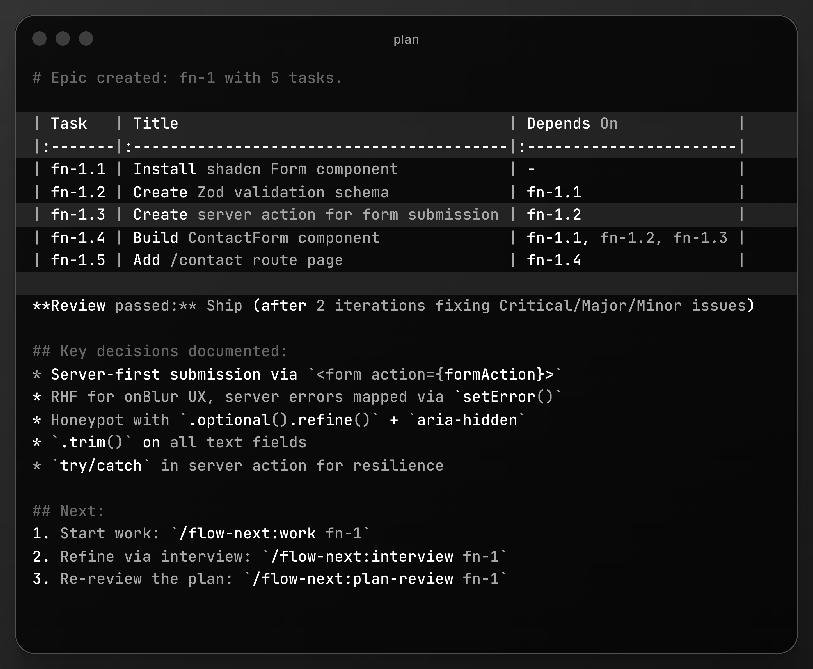
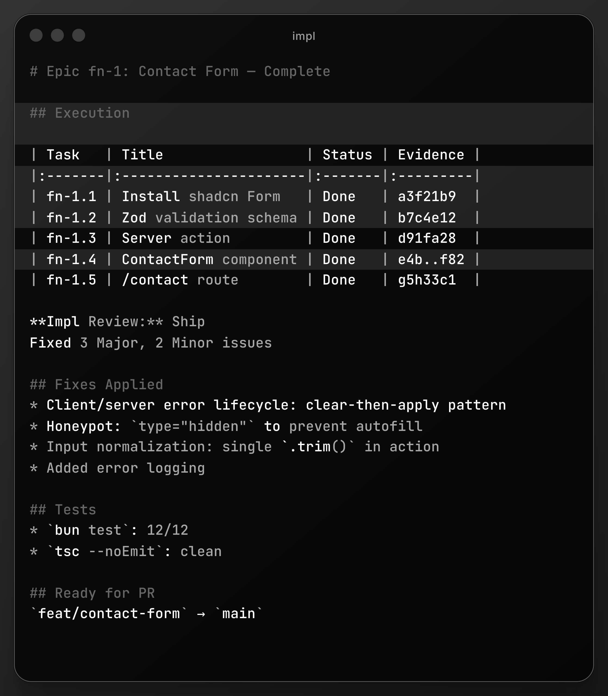
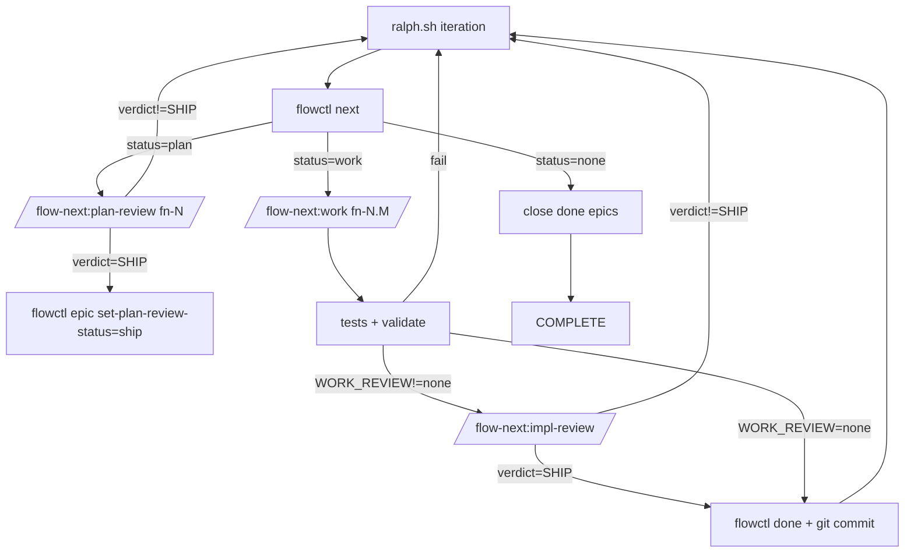

<div align="center">

# Flow-Next

[](../../LICENSE)
[](https://claude.ai/code)
[](../../CHANGELOG.md)
[]()

**Plan first, work second. Zero external dependencies.**

</div>

---

> **Experimental.** This plugin is under active development. Give it a spin and [report issues](https://github.com/gmickel/gmickel-claude-marketplace/issues).

---

## What Is This?

Flow-Next is a Claude Code plugin for plan-first orchestration. Bundled task tracking, dependency graphs, re-anchoring, and cross-model reviews.

Everything lives in your repo. No external services. No global config. Uninstall: delete `.flow/` (and `scripts/ralph/` if enabled).

**Agents that finish what they start.**

<table>
<tr>
<td></td>
<td></td>
</tr>
<tr>
<td align="center"><em>Planning: dependency-ordered tasks</em></td>
<td align="center"><em>Execution: fixes, evidence, review</em></td>
</tr>
</table>

---

## Epic-first task model

Flow-Next does not support standalone tasks.

Every unit of work belongs to an epic fn-N (even if it's a single task).

Tasks are always fn-N.M and inherit context from the epic spec.

Flow-Next always creates an epic container (even for one-offs) so every task has a durable home for context, re-anchoring, and automation. You never have to think about it.

Rationale: keeps the system simple, improves re-anchoring, makes automation (Ralph) reliable.

"One-off request" -> epic with one task.

---

## Why I Built This

Process failures, not model failures.

- Forgetting the plan mid-implementation
- Losing context in long sessions
- Drifting from original intent
- Skipping edge cases obvious in hindsight

Flow-Next gives agents structured task graphs, forces re-anchoring before every task, records evidence of completion, and runs cross-model reviews.

Instead of relying on external CLIs and config file edits, Flow-Next bundles a fully-featured task system in a single Python script:

- **Works in 30 seconds.** Install the plugin, run a command. No setup.
- **Non-invasive.** No CLAUDE.md edits. No daemons. (Ralph uses plugin hooks for enforcement.)
- **Clean uninstall.** Delete `.flow/` (and `scripts/ralph/` if enabled).
- **Multi-user safe.** Teams work parallel branches without coordination servers.

---

## Install

```bash
/plugin marketplace add https://github.com/gmickel/gmickel-claude-marketplace
/plugin install flow-next
```

Try it in ~30 seconds. Uninstall with `rm -rf .flow/` (and `rm -rf scripts/ralph/` if enabled).

## Uninstall

Standard Flow-Next:
```bash
rm -rf .flow/
```

If you enabled Ralph:
```bash
rm -rf scripts/ralph/
```

---

## Quick Start

```bash
# 1. Plan: research, create epic with tasks
/flow-next:plan Add a contact form with validation

# 2. Work: execute tasks in dependency order
/flow-next:work fn-1
```

This creates an epic (fn-N) even for small requests, then breaks it into tasks.

Start with a short spec (prompt or file). If fuzzy, run `/flow-next:interview` first.

That's it. Flow-Next handles research, task ordering, reviews, and audit trails.

---

## Ralph (Autonomous Mode)

Ralph is the repo-local autonomous loop that plans and works through tasks end-to-end.

**Setup (one-time, inside Claude):**
```bash
/flow-next:ralph-init
```

Or from terminal without entering Claude:
```bash
claude -p "/flow-next:ralph-init"
```

**Run (outside Claude):**
```bash
scripts/ralph/ralph.sh
```

Ralph writes run artifacts under `scripts/ralph/runs/`, including review receipts used for gating.

> **⚠️ Warning**: Autonomous code generation is powerful but requires care. Start with `ralph_once.sh` to observe a single iteration. Consider running in a [Docker sandbox](https://docs.docker.com/ai/sandboxes/claude-code/) for extra isolation.

📖 **[Ralph deep dive](docs/ralph.md)**

### How Ralph Differs from Other Autonomous Agents

Autonomous coding agents are taking the industry by storm—loop until done, commit, repeat. Most solutions gate progress by tests and linting alone. Ralph goes further.

**Multi-model review gates**: Ralph uses [RepoPrompt](https://repoprompt.com/?atp=KJbuL4) to send plan and implementation reviews to a *different* model (we recommend GPT-5.2 High). A second set of eyes catches blind spots that self-review misses. The reviewing model sees full file context via RepoPrompt's builder, not just diffs.

**Review loops until Ship**: Reviews don't just flag issues—they block progress until resolved. Ralph runs fix → re-review cycles until the reviewer returns `<verdict>SHIP</verdict>`. No "LGTM with nits" that get ignored.

**Receipt-based gating**: Reviews must produce a receipt JSON file proving they ran. No receipt = no progress. This prevents drift where Claude skips the review step and marks things done anyway.

**Guard hooks**: Plugin hooks enforce workflow rules deterministically—blocking `--json` flags, preventing new chats on re-reviews, requiring receipts before stop. Only active when `FLOW_RALPH=1`; zero impact for non-Ralph users. See [Guard Hooks](docs/ralph.md#guard-hooks).

**Atomic window selection**: The `setup-review` command handles RepoPrompt window matching atomically. Claude can't skip steps or invent window IDs—the entire sequence runs as one unit or fails.

The result: code that's been reviewed by two models, tested, linted, and iteratively refined. Not perfect, but meaningfully more robust than single-model autonomous loops.

---

## Human-in-the-Loop Workflow (Detailed)

Default flow when you drive manually:

```mermaid
flowchart TD
  A[Idea or short spec<br/>prompt or doc] --> B{Need deeper spec?}
  B -- yes --> C[Optional: /flow-next:interview fn-N or spec.md<br/>40+ deep questions to refine spec]
  C --> D[Refined spec]
  B -- no --> D
  D --> E[/flow-next:plan idea or fn-N/]
  E --> F[Parallel subagents: repo patterns + online docs + best practices]
  F --> G[flow-gap-analyst: edge cases + missing reqs]
  G --> H[Writes .flow/ epic + tasks + deps]
  H --> I{Plan review? RepoPrompt only}
  I -- yes --> J[/flow-next:plan-review fn-N/]
  J --> K{Plan passes review?}
  K -- no --> L[Re-anchor + fix plan]
  L --> J
  K -- yes --> M[/flow-next:work fn-N/]
  I -- no --> M
  M --> N[Re-anchor before EVERY task]
  N --> O[Implement]
  O --> P[Test + verify acceptance]
  P --> Q[flowctl done: write done summary + evidence]
  Q --> R{Impl review? RepoPrompt only}
  R -- yes --> S[/flow-next:impl-review/]
  S --> T{Next ready task?}
  R -- no --> T
  T -- yes --> N
  T -- no --> U[Close epic (manual or Ralph)]
  classDef optional stroke-dasharray: 6 4,stroke:#999;
  class C,J,S optional;
```

Notes:
- `/flow-next:interview` accepts Flow IDs or spec file paths and writes refinements back
- `/flow-next:plan` accepts new ideas or an existing Flow ID to update the plan

Recommendation: open RepoPrompt in the repo before starting a new flow so plan/impl reviews have fast context.
Plan review in rp mode requires `flowctl rp chat-send`; if rp-cli/windows unavailable, the review gate retries.

---

## Features

Built for reliability. These are the guardrails.

### Re-anchoring

Before EVERY task, Flow-Next re-reads:
- Epic spec and task spec from `.flow/`
- Current git status and recent commits
- Validation state

Per Anthropic's long-running agent guidance: agents must re-anchor from sources of truth to prevent drift. The reads are cheap; drift is expensive.

### Multi-user Safe

Teams can work in parallel branches without coordination servers:

- **Merge-safe IDs**: Scans existing files to allocate the next ID. No shared counters.
- **Soft claims**: Tasks track an `assignee` field. Prevents accidental duplicate work.
- **Actor resolution**: Auto-detects from git email, `FLOW_ACTOR` env, or `$USER`.
- **Local validation**: `flowctl validate --all` catches issues before commit.

```bash
# Actor A starts task
flowctl start fn-1.1   # Sets assignee automatically

# Actor B tries same task
flowctl start fn-1.1   # Fails: "claimed by actor-a@example.com"
flowctl start fn-1.1 --force  # Override if needed
```

### Zero Dependencies

Everything is bundled:
- `flowctl.py` ships with the plugin
- No external tracker CLI to install
- No external services
- Just Python 3

### Non-invasive

- No daemons
- No CLAUDE.md edits
- Delete `.flow/` to uninstall; if you enabled Ralph, also delete `scripts/ralph/`
- Ralph uses plugin hooks for workflow enforcement (only active when `FLOW_RALPH=1`)

### CI-ready

```bash
flowctl validate --all
```

Exits 1 on errors. Drop into pre-commit hooks or GitHub Actions. See `docs/ci-workflow-example.yml`.

### One File Per Task

Each epic and task gets its own JSON + markdown file pair. Merge conflicts are rare and easy to resolve.

### Automated Reviews

Reviews require [rp-cli](https://repoprompt.com/?atp=KJbuL4) ([RepoPrompt](https://repoprompt.com/?atp=KJbuL4)). Without it, review steps are skipped. Cross-model review catches blind spots.

### Dependency Graphs

Tasks declare their blockers. `flowctl ready` shows what can start. Nothing executes until dependencies resolve.

---

## Commands

Five commands, complete workflow:

| Command | What It Does |
|---------|--------------|
| `/flow-next:plan <idea>` | Research the codebase, create epic with dependency-ordered tasks |
| `/flow-next:work <id>` | Execute epic or single task, re-anchoring before each |
| `/flow-next:interview <id>` | Deep interview to flesh out a spec before planning |
| `/flow-next:plan-review <id>` | Carmack-level plan review via RepoPrompt |
| `/flow-next:impl-review` | Carmack-level impl review of current branch |
| `/flow-next:ralph-init` | Scaffold repo-local Ralph harness (`scripts/ralph/`) |

Work accepts an epic (fn-N) or a task (fn-N.M). Tasks always belong to an epic.

### Autonomous Mode (Flags)

All commands accept flags to skip questions:

```bash
# Plan with flags
/flow-next:plan Add caching --research=grep --no-review
/flow-next:plan Add auth --research=rp --review=rp

# Work with flags
/flow-next:work fn-1 --branch=current --no-review
/flow-next:work fn-1 --branch=new --review=export

# Reviews with flags
/flow-next:plan-review fn-1 --mode=rp
/flow-next:impl-review --mode=export
```

Natural language also works:

```bash
/flow-next:plan Add webhooks, use context-scout, skip review
/flow-next:work fn-1 current branch, no review
```

| Command | Available Flags |
|---------|-----------------|
| `/flow-next:plan` | `--research=rp\|grep`, `--review=rp\|export\|none`, `--no-review` |
| `/flow-next:work` | `--branch=current\|new\|worktree`, `--review=rp\|export\|none`, `--no-review` |
| `/flow-next:plan-review` | `--mode=rp\|export` |
| `/flow-next:impl-review` | `--mode=rp\|export` |

---

## The Workflow

### Defaults (manual and Ralph)

Flow-Next uses the same defaults in manual and Ralph runs. Ralph bypasses prompts only.

- plan: `--research=grep`
- work: `--branch=new`
- review: `rp` when `rp-cli` exists, otherwise `none`

Override via flags or `scripts/ralph/config.env`.

### Planning Phase

1. **Research (parallel subagents)**: `repo-scout` (or `context-scout` if rp-cli) + `practice-scout` + `docs-scout`
2. **Gap analysis**: `flow-gap-analyst` finds edge cases + missing requirements
3. **Epic creation**: Writes spec to `.flow/specs/fn-N.md`
4. **Task breakdown**: Creates tasks + explicit dependencies in `.flow/tasks/`
5. **Validate**: `flowctl validate --epic fn-N`
6. **Review** (optional): `/flow-next:plan-review fn-N` with re-anchor + fix loop until "Ship"

### Work Phase

1. **Re-anchor**: Re-read epic + task specs + git state (EVERY task)
2. **Execute**: Implement using existing patterns
3. **Test**: Verify acceptance criteria
4. **Record**: `flowctl done` adds summary + evidence to the task spec
5. **Review** (optional): `/flow-next:impl-review` via RepoPrompt
6. **Loop**: Next ready task → repeat until no ready tasks. Close epic manually (`flowctl epic close fn-N`) or let Ralph close at loop end.

---

## Ralph Mode (Autonomous, Opt-In)

Ralph is repo-local and opt-in. Files are created only by `/flow-next:ralph-init`. Remove with `rm -rf scripts/ralph/`.
`/flow-next:ralph-init` also writes `scripts/ralph/.gitignore` so run logs stay out of git.

What it automates (one unit per iteration, fresh context each time):
- Selector chooses plan vs work unit (`flowctl next`)
- Plan gate = plan review loop until Ship (if enabled)
- Work gate = one task until pass (tests + validate + optional impl review)
 - Branch-per-epic: one branch per epic per run (no auto-merge)

Enable:
```bash
/flow-next:ralph-init
./scripts/ralph/ralph_once.sh   # one iteration (interactive)
./scripts/ralph/ralph.sh        # full loop (AFK)
```
`ralph_once.sh` runs a single unit in interactive Claude so you can follow along step-by-step.

### Ralph defaults vs recommended (plan review gate)

`REQUIRE_PLAN_REVIEW` controls whether Ralph must pass the **plan review gate** before doing any implementation work.

**Default (safe, won't stall):**

* `REQUIRE_PLAN_REVIEW=0`
  Ralph can proceed to work tasks even if `rp-cli` is missing or unavailable overnight.

**Recommended (best results, requires rp-cli):**

* `REQUIRE_PLAN_REVIEW=1`
* `PLAN_REVIEW=rp`

This forces Ralph to run `/flow-next:plan-review` until the epic plan is approved before starting tasks.

**Tip:** If you don't have `rp-cli` installed, keep `REQUIRE_PLAN_REVIEW=0` or Ralph may repeatedly select the plan gate and make no progress.

Ralph verifies RepoPrompt reviews via receipt JSON files in `scripts/ralph/runs/<run>/receipts/` (plan + impl).

### Ralph loop (one iteration)



**YOLO safety**: YOLO mode uses `--dangerously-skip-permissions`. Use a sandbox/container and no secrets in env for unattended runs.

---

## .flow/ Directory

```
.flow/
├── meta.json              # Schema version
├── epics/
│   └── fn-1.json          # Epic metadata (id, title, status, deps)
├── specs/
│   └── fn-1.md            # Epic spec (plan, scope, acceptance)
├── tasks/
│   ├── fn-1.1.json        # Task metadata (id, status, priority, deps, assignee)
│   ├── fn-1.1.md          # Task spec (description, acceptance, done summary)
│   └── ...
└── memory/                # Reserved for future context features
```

Flowctl accepts schema v1 and v2; new fields are optional and defaulted.

New fields:
- Epic JSON: `plan_review_status`, `plan_reviewed_at`, `depends_on_epics`, `branch_name`
- Task JSON: `priority`

### ID Format

- **Epic**: `fn-N` (e.g., `fn-1`, `fn-42`)
- **Task**: `fn-N.M` (e.g., `fn-1.1`, `fn-42.7`)

There are no task IDs outside an epic. If you want a single task, create an epic with one task.

### Separation of Concerns

- **JSON files**: Metadata only (IDs, status, dependencies, assignee)
- **Markdown files**: Narrative content (specs, descriptions, summaries)

---

## flowctl CLI

Bundled Python script for managing `.flow/`. Skills call this automatically, but you can use it directly:

```bash
# Setup
flowctl init                              # Create .flow/ structure
flowctl detect                            # Check if .flow/ exists

# Epics
flowctl epic create --title "..."         # Create epic
flowctl epic create --title "..." --branch "fn-1-epic"
flowctl epic set-plan fn-1 --file spec.md # Set epic spec from file
flowctl epic set-plan-review-status fn-1 --status ship
flowctl epic close fn-1                   # Close epic (requires all tasks done)

# Tasks
flowctl task create --epic fn-1 --title "..." --deps fn-1.2,fn-1.3 --priority 10
flowctl task set-description fn-1.1 --file desc.md
flowctl task set-acceptance fn-1.1 --file accept.md

# Dependencies
flowctl dep add fn-1.3 fn-1.2             # fn-1.3 depends on fn-1.2

# Workflow
flowctl ready --epic fn-1                 # Show ready/in_progress/blocked
flowctl next                              # Select next plan/work unit
flowctl start fn-1.1                      # Claim and start task
flowctl done fn-1.1 --summary-file s.md --evidence-json e.json
flowctl block fn-1.2 --reason-file r.md

# Queries
flowctl show fn-1 --json                  # Epic with all tasks
flowctl cat fn-1                          # Print epic spec

# Validation
flowctl validate --epic fn-1              # Validate single epic
flowctl validate --all                    # Validate everything (for CI)

# Review helpers
flowctl rp chat-send --window W --tab T --message-file m.md
flowctl prep-chat --message-file m.md --selected-paths a.ts b.ts -o payload.json
```

📖 **[Full CLI reference](docs/flowctl.md)**  
🤖 **[Ralph deep dive](docs/ralph.md)**

---

## Task Completion

When a task completes, `flowctl done` appends structured data to the task spec:

### Done Summary

```markdown
## Done summary

- Added ContactForm component with Zod validation
- Integrated with server action for submission
- All tests passing

Follow-ups:
- Consider rate limiting (out of scope)
```

### Evidence

```markdown
## Evidence

- Commits: a3f21b9
- Tests: bun test
- PRs:
```

This creates a complete audit trail: what was planned, what was done, how it was verified.

---

## Flow vs Flow-Next

| | Flow | Flow-Next |
|:--|:--|:--|
| **Task tracking** | External tracker or standalone plan files | `.flow/` directory (bundled flowctl) |
| **Install** | Plugin + optional external tracker | Plugin only |
| **Artifacts** | Standalone plan files | `.flow/specs/` and `.flow/tasks/` |
| **Config edits** | External config edits (if using tracker) | None |
| **Multi-user** | Via external tracker | Built-in (scan-based IDs, soft claims) |
| **Uninstall** | Remove plugin + external tracker config | Delete `.flow/` (and `scripts/ralph/` if enabled) |

**Choose Flow-Next if you want:**
- Zero external dependencies
- No config file edits
- Clean uninstall (delete `.flow/`, and `scripts/ralph/` if enabled)
- Built-in multi-user safety

**Choose Flow if you:**
- Already use an external tracker for issue tracking
- Want plan files as standalone artifacts
- Need full issue management features

---

## Requirements

- Python 3.8+
- git
- [rp-cli](https://repoprompt.com/?atp=KJbuL4) ([RepoPrompt](https://repoprompt.com/?atp=KJbuL4)) — optional but highly recommended. Enables the entire review flow: AI-powered context building, cross-model plan reviews, and implementation reviews using a separate model. Without it, reviews are skipped.

---

## Development

```bash
claude --plugin-dir ./plugins/flow-next
```

---

## Other Platforms

### OpenAI Codex (Experimental)

Flow-Next partially works in OpenAI Codex with some limitations:

I have fully ported Flow-Next to OpenCode and will release and link here soon

**Caveats:**
- No subagent support (research scouts run inline or are skipped)

**Install:**
```bash
./scripts/install-codex.sh flow-next
```

---

<div align="center">

Made by [Gordon Mickel](https://mickel.tech) · [@gmickel](https://twitter.com/gmickel)

</div>
