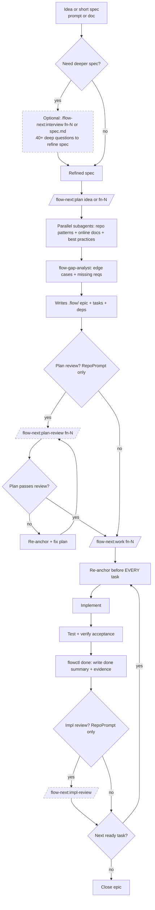

<div align="center">

# Flow-Next

[](../../LICENSE)
[](https://claude.ai/code)
[](../../CHANGELOG.md)
[](../../CHANGELOG.md)

**Plan first, work second. Zero external dependencies.**

</div>

---

> **Active development.** [Changelog](../../CHANGELOG.md) | [Report issues](https://github.com/gmickel/gmickel-claude-marketplace/issues)

🌐 **Prefer a visual overview?** See the [Flow-Next app page](https://mickel.tech/apps/flow-next) for diagrams and examples.

> **New: Codex Review Backend.** Cross-model reviews now work on Linux/Windows via OpenAI Codex CLI. Same Carmack-level criteria as RepoPrompt. See [Cross-Model Reviews](#cross-model-reviews) for setup.

---

## What Is This?

Flow-Next is a Claude Code plugin for plan-first orchestration. Bundled task tracking, dependency graphs, re-anchoring, and cross-model reviews.

Everything lives in your repo. No external services. No global config. Uninstall: delete `.flow/` (and `scripts/ralph/` if enabled).

<table>
<tr>
<td></td>
<td></td>
</tr>
<tr>
<td align="center"><em>Planning: dependency-ordered tasks</em></td>
<td align="center"><em>Execution: fixes, evidence, review</em></td>
</tr>
</table>

---

## Epic-first task model

Flow-Next does not support standalone tasks.

Every unit of work belongs to an epic fn-N (even if it's a single task).

Tasks are always fn-N.M and inherit context from the epic spec.

Flow-Next always creates an epic container (even for one-offs) so every task has a durable home for context, re-anchoring, and automation. You never have to think about it.

Rationale: keeps the system simple, improves re-anchoring, makes automation (Ralph) reliable.

"One-off request" -> epic with one task.

---

## Why It Works

### You Control the Granularity

Work task-by-task with full review cycles for maximum control. Or throw the whole epic at it and let Flow-Next handle everything. Same guarantees either way.

```bash
# One task at a time (review after each)
/flow-next:work fn-1.1

# Entire epic (review after all tasks complete)
/flow-next:work fn-1
```

Both get: re-anchoring before each task, evidence recording, cross-model review (if rp-cli available).

**Review timing**: The RepoPrompt review runs once at the end of the work package—after a single task if you specified `fn-N.M`, or after all tasks if you specified `fn-N`. For tighter review loops on large epics, work task-by-task.

### No Context Length Worries

- **Tasks sized at planning:** Every task is scoped to fit one work iteration
- **Re-anchor every task:** Fresh context from `.flow/` specs before each task
- **Survives compaction:** Re-anchors after conversation summarization too
- **Fresh context in Ralph:** Each iteration starts with a clean context window

Never worry about 200K token limits again.

### Reviewer as Safety Net

If drift happens despite re-anchoring, a different model catches it before it compounds:

1. Claude implements task
2. GPT reviews via RepoPrompt (sees full files, not diffs)
3. Reviews block until `SHIP` verdict
4. Fix → re-review cycles continue until approved

Two models catch what one misses.

---

### Zero Friction

- **Works in 30 seconds.** Install the plugin, run a command. No setup.
- **Non-invasive.** No CLAUDE.md edits. No daemons. (Ralph uses plugin hooks for enforcement.)
- **Clean uninstall.** Delete `.flow/` (and `scripts/ralph/` if enabled).
- **Multi-user safe.** Teams work parallel branches without coordination servers.

---

## Quick Start

### 1. Install

```bash
# Add marketplace
/plugin marketplace add https://github.com/gmickel/gmickel-claude-marketplace

# Install flow-next
/plugin install flow-next
```

### 2. Setup (Recommended)

```bash
/flow-next:setup
```

This is technically optional but **highly recommended**. Great for power users and non-Claude-Code environments (Codex, Cursor, etc.). It:
- Copies `flowctl` to `.flow/bin/` for direct CLI access
- Adds flow-next instructions to CLAUDE.md/AGENTS.md (helps other AI tools understand your project)
- Creates `.flow/usage.md` with full CLI reference
- Tracks setup version for updates

**Idempotent** - safe to re-run. Detects plugin updates and refreshes scripts automatically.

After setup:
```bash
export PATH=".flow/bin:$PATH"
flowctl --help
flowctl epics                # List all epics
flowctl tasks --epic fn-1    # List tasks for epic
flowctl ready --epic fn-1    # What's ready to work on
```

### 3. Use

```bash
# Plan: research, create epic with tasks
/flow-next:plan Add a contact form with validation

# Work: execute tasks in dependency order
/flow-next:work fn-1
```

That's it. Flow-Next handles research, task ordering, reviews, and audit trails.

### Recommended Workflow

**Spec -> Interview -> Plan -> Work**

1. **Write a short spec** - 1-5 sentences describing what you want to build
2. **Interview** (optional) - `/flow-next:interview "your idea"` - 40+ questions to surface edge cases
3. **Plan** - `/flow-next:plan "your idea"` - creates epic with dependency-ordered tasks
4. **Work** - `/flow-next:work fn-1` - executes tasks with re-anchoring and reviews

Start simple. Add interview when specs are fuzzy. Add reviews when quality matters.

### 4. Autonomous Mode (Optional)

Want to run overnight? See [Ralph Mode](#ralph-autonomous-mode).

---

## Troubleshooting

### Reset a stuck task

```bash
# Check task status
flowctl show fn-1.2 --json | jq '.status'

# Mark as pending to retry
flowctl task set fn-1.2 --status pending
```

### Clean up `.flow/` safely

```bash
# Remove all flow state (keeps git history)
rm -rf .flow/

# Re-initialize
flowctl init
```

### Debug Ralph runs

```bash
# Check run progress
cat scripts/ralph/runs/*/progress.txt

# View iteration logs
ls scripts/ralph/runs/*/iter-*.log

# Check for blocked tasks
ls scripts/ralph/runs/*/block-*.md
```

### Receipt validation failing

```bash
# Check receipt exists
ls scripts/ralph/runs/*/receipts/

# Verify receipt format
cat scripts/ralph/runs/*/receipts/impl-fn-1.1.json
# Must have: {"type":"impl_review","id":"fn-1.1",...}
```

---

## Uninstall

```bash
rm -rf .flow/               # Core flow state
rm -rf scripts/ralph/       # Ralph (if enabled)
```

---

## Ralph (Autonomous Mode)

> **⚠️ Safety first**: Ralph defaults to `YOLO=1` (skips permission prompts).
> - Start with `ralph_once.sh` to observe one iteration
> - Consider [Docker sandbox](https://docs.docker.com/ai/sandboxes/claude-code/) for isolation

Ralph is the repo-local autonomous loop that plans and works through tasks end-to-end.

**Setup (one-time, inside Claude):**
```bash
/flow-next:ralph-init
```

Or from terminal without entering Claude:
```bash
claude -p "/flow-next:ralph-init"
```

**Run (outside Claude):**
```bash
scripts/ralph/ralph.sh
```

Ralph writes run artifacts under `scripts/ralph/runs/`, including review receipts used for gating.

📖 **[Ralph deep dive](docs/ralph.md)**

### How Ralph Differs from Other Autonomous Agents

Autonomous coding agents are taking the industry by storm—loop until done, commit, repeat. Most solutions gate progress by tests and linting alone. Ralph goes further.

**Multi-model review gates**: Ralph uses [RepoPrompt](https://repoprompt.com/?atp=KJbuL4) (macOS) or OpenAI Codex CLI (cross-platform) to send plan and implementation reviews to a *different* model. A second set of eyes catches blind spots that self-review misses. RepoPrompt's builder provides full file context; Codex uses context hints from changed files.

**Review loops until Ship**: Reviews don't just flag issues—they block progress until resolved. Ralph runs fix → re-review cycles until the reviewer returns `<verdict>SHIP</verdict>`. No "LGTM with nits" that get ignored.

**Receipt-based gating**: Reviews must produce a receipt JSON file proving they ran. No receipt = no progress. This prevents drift where Claude skips the review step and marks things done anyway.

**Guard hooks**: Plugin hooks enforce workflow rules deterministically—blocking `--json` flags, preventing new chats on re-reviews, requiring receipts before stop. Only active when `FLOW_RALPH=1`; zero impact for non-Ralph users. See [Guard Hooks](docs/ralph.md#guard-hooks).

**Atomic window selection**: The `setup-review` command handles RepoPrompt window matching atomically. Claude can't skip steps or invent window IDs—the entire sequence runs as one unit or fails.

The result: code that's been reviewed by two models, tested, linted, and iteratively refined. Not perfect, but meaningfully more robust than single-model autonomous loops.

---

## Human-in-the-Loop Workflow (Detailed)

Default flow when you drive manually:



Notes:
- `/flow-next:interview` accepts Flow IDs or spec file paths and writes refinements back
- `/flow-next:plan` accepts new ideas or an existing Flow ID to update the plan

Recommendation: open RepoPrompt in the repo before starting a new flow so plan/impl reviews have fast context.
Plan review in rp mode requires `flowctl rp chat-send`; if rp-cli/windows unavailable, the review gate retries.

---

## Features

Built for reliability. These are the guardrails.

**Re-anchoring prevents drift**

Before EVERY task, Flow-Next re-reads the epic spec, task spec, and git state from `.flow/`. This forces Claude back to the source of truth - no hallucinated scope creep, no forgotten requirements. In Ralph mode, this happens automatically each iteration.

Unlike agents that carry accumulated context (where early mistakes compound), re-anchoring gives each task a fresh, accurate starting point.

### Re-anchoring

Before EVERY task, Flow-Next re-reads:
- Epic spec and task spec from `.flow/`
- Current git status and recent commits
- Validation state

Per Anthropic's long-running agent guidance: agents must re-anchor from sources of truth to prevent drift. The reads are cheap; drift is expensive.

### Multi-user Safe

Teams can work in parallel branches without coordination servers:

- **Merge-safe IDs**: Scans existing files to allocate the next ID. No shared counters.
- **Soft claims**: Tasks track an `assignee` field. Prevents accidental duplicate work.
- **Actor resolution**: Auto-detects from git email, `FLOW_ACTOR` env, or `$USER`.
- **Local validation**: `flowctl validate --all` catches issues before commit.

```bash
# Actor A starts task
flowctl start fn-1.1   # Sets assignee automatically

# Actor B tries same task
flowctl start fn-1.1   # Fails: "claimed by actor-a@example.com"
flowctl start fn-1.1 --force  # Override if needed
```

### Zero Dependencies

Everything is bundled:
- `flowctl.py` ships with the plugin
- No external tracker CLI to install
- No external services
- Just Python 3

### Non-invasive

- No daemons
- No CLAUDE.md edits
- Delete `.flow/` to uninstall; if you enabled Ralph, also delete `scripts/ralph/`
- Ralph uses plugin hooks for workflow enforcement (only active when `FLOW_RALPH=1`)

### CI-ready

```bash
flowctl validate --all
```

Exits 1 on errors. Drop into pre-commit hooks or GitHub Actions. See `docs/ci-workflow-example.yml`.

### One File Per Task

Each epic and task gets its own JSON + markdown file pair. Merge conflicts are rare and easy to resolve.

### Cross-Model Reviews

Two models catch what one misses. Reviews use a second model (via RepoPrompt or Codex) to verify plans and implementations before they ship.

**Review criteria (Carmack-level, identical for both backends):**

| Review Type | Criteria |
|-------------|----------|
| **Plan** | Completeness, Feasibility, Clarity, Architecture, Risks (incl. security), Scope, Testability |
| **Impl** | Correctness, Simplicity, DRY, Architecture, Edge Cases, Tests, Security |

Reviews block progress until `<verdict>SHIP</verdict>`. Fix → re-review cycles continue until approved.

#### RepoPrompt (Recommended)

[RepoPrompt](https://repoprompt.com/?atp=KJbuL4) provides the best review experience on macOS.

**Why recommended:**
- Builder provides full file context with intelligent selection
- Visual interface for reviewing diffs
- Maintains conversation history across reviews

**Setup:**
```bash
# Install rp-cli (macOS only)
brew install --cask repoprompt
# Open RepoPrompt on your repo before running reviews
```

**Usage:**
```bash
/flow-next:plan-review fn-1 --review=rp
/flow-next:impl-review --review=rp
```

#### Codex (Cross-Platform Alternative)

OpenAI Codex CLI works on any platform (macOS, Linux, Windows).

**Why use Codex:**
- Cross-platform (no macOS requirement)
- Terminal-based (no GUI needed)
- Session continuity via thread IDs
- Same Carmack-level review criteria as RepoPrompt
- Uses GPT 5.2 High by default (no config needed)

**Trade-off:** Uses heuristic context hints from changed files rather than RepoPrompt's intelligent file selection.

**Setup:**
```bash
# Install and authenticate Codex CLI
npm install -g @openai/codex
codex auth
```

**Usage:**
```bash
/flow-next:plan-review fn-1 --review=codex
/flow-next:impl-review --review=codex

# Or via flowctl directly
flowctl codex plan-review fn-1 --base main
flowctl codex impl-review fn-1.3 --base main
```

**Verify installation:**
```bash
flowctl codex check
```

#### Configuration

Set default review backend:
```bash
# Per-project (saved in .flow/config.json)
flowctl config set review.backend rp      # or codex, or none

# Per-session (environment variable)
export FLOW_REVIEW_BACKEND=codex
```

Priority: `--review=...` argument > `FLOW_REVIEW_BACKEND` env > `.flow/config.json` > auto-detect.

#### Which to Choose?

| Scenario | Recommendation |
|----------|----------------|
| macOS with GUI available | RepoPrompt (better context) |
| Linux/Windows | Codex (only option) |
| CI/headless environments | Codex (no GUI needed) |
| Ralph overnight runs | Either works; RP needs window open |

Without either backend installed, reviews are skipped with a warning.

### Dependency Graphs

Tasks declare their blockers. `flowctl ready` shows what can start. Nothing executes until dependencies resolve.

### Auto-Block Stuck Tasks

After MAX_ATTEMPTS_PER_TASK failures (default 5), Ralph:
1. Writes `block-<task>.md` with failure context
2. Marks task blocked via `flowctl block`
3. Moves to next task

Prevents infinite retry loops. Review `block-*.md` files in the morning to understand what went wrong.

### Memory System (Opt-in)

Persistent learnings that survive context compaction.

```bash
# Enable
flowctl config set memory.enabled true
flowctl memory init

# Manual entries
flowctl memory add --type pitfall "Always use flowctl rp wrappers"
flowctl memory add --type convention "Tests in __tests__ dirs"
flowctl memory add --type decision "SQLite over Postgres for simplicity"

# Query
flowctl memory list
flowctl memory search "flowctl"
flowctl memory read --type pitfalls
```

When enabled:
- **Planning**: `memory-scout` runs in parallel with other scouts
- **Work**: `memory-scout` retrieves relevant entries during re-anchor
- **Ralph only**: NEEDS_WORK reviews auto-capture to `pitfalls.md`

Memory retrieval works in both manual and Ralph modes. Auto-capture from reviews only happens in Ralph mode (via hooks). Use `flowctl memory add` for manual entries.

Config lives in `.flow/config.json`, separate from Ralph's `scripts/ralph/config.env`.

---

## Commands

Seven commands, complete workflow:

| Command | What It Does |
|---------|--------------|
| `/flow-next:plan <idea>` | Research the codebase, create epic with dependency-ordered tasks |
| `/flow-next:work <id>` | Execute epic or single task, re-anchoring before each |
| `/flow-next:interview <id>` | Deep interview to flesh out a spec before planning |
| `/flow-next:plan-review <id>` | Carmack-level plan review via RepoPrompt |
| `/flow-next:impl-review` | Carmack-level impl review of current branch |
| `/flow-next:ralph-init` | Scaffold repo-local Ralph harness (`scripts/ralph/`) |
| `/flow-next:setup` | Optional: install flowctl locally + add docs (for power users) |
| `/flow-next:uninstall` | Remove flow-next from project (keeps tasks if desired) |

Work accepts an epic (fn-N) or a task (fn-N.M). Tasks always belong to an epic.

### Autonomous Mode (Flags)

All commands accept flags to skip questions:

```bash
# Plan with flags
/flow-next:plan Add caching --research=grep --no-review
/flow-next:plan Add auth --research=rp --review=rp

# Work with flags
/flow-next:work fn-1 --branch=current --no-review
/flow-next:work fn-1 --branch=new --review=export

# Reviews with flags
/flow-next:plan-review fn-1 --review=rp
/flow-next:impl-review --review=export
```

Natural language also works:

```bash
/flow-next:plan Add webhooks, use context-scout, skip review
/flow-next:work fn-1 current branch, no review
```

| Command | Available Flags |
|---------|-----------------|
| `/flow-next:plan` | `--research=rp\|grep`, `--review=rp\|codex\|export\|none`, `--no-review` |
| `/flow-next:work` | `--branch=current\|new\|worktree`, `--review=rp\|codex\|export\|none`, `--no-review` |
| `/flow-next:plan-review` | `--review=rp\|codex\|export` |
| `/flow-next:impl-review` | `--review=rp\|codex\|export` |

---

## The Workflow

### Defaults (manual and Ralph)

Flow-Next uses the same defaults in manual and Ralph runs. Ralph bypasses prompts only.

- plan: `--research=grep`
- work: `--branch=new`
- review: `rp` when `rp-cli` exists, otherwise `none`

Override via flags or `scripts/ralph/config.env`.

### Planning Phase

1. **Research (parallel subagents)**: `repo-scout` (or `context-scout` if rp-cli) + `practice-scout` + `docs-scout`
2. **Gap analysis**: `flow-gap-analyst` finds edge cases + missing requirements
3. **Epic creation**: Writes spec to `.flow/specs/fn-N.md`
4. **Task breakdown**: Creates tasks + explicit dependencies in `.flow/tasks/`
5. **Validate**: `flowctl validate --epic fn-N`
6. **Review** (optional): `/flow-next:plan-review fn-N` with re-anchor + fix loop until "Ship"

### Work Phase

1. **Re-anchor**: Re-read epic + task specs + git state (EVERY task)
2. **Execute**: Implement using existing patterns
3. **Test**: Verify acceptance criteria
4. **Record**: `flowctl done` adds summary + evidence to the task spec
5. **Review** (optional): `/flow-next:impl-review` via RepoPrompt
6. **Loop**: Next ready task → repeat until no ready tasks. Close epic manually (`flowctl epic close fn-N`) or let Ralph close at loop end.

---

## Ralph Mode (Autonomous, Opt-In)

Ralph is repo-local and opt-in. Files are created only by `/flow-next:ralph-init`. Remove with `rm -rf scripts/ralph/`.
`/flow-next:ralph-init` also writes `scripts/ralph/.gitignore` so run logs stay out of git.

What it automates (one unit per iteration, fresh context each time):
- Selector chooses plan vs work unit (`flowctl next`)
- Plan gate = plan review loop until Ship (if enabled)
- Work gate = one task until pass (tests + validate + optional impl review)
 - Single run branch: all epics work on one `ralph-<run-id>` branch (cherry-pick/revert friendly)

Enable:
```bash
/flow-next:ralph-init
./scripts/ralph/ralph_once.sh   # one iteration (observe)
./scripts/ralph/ralph.sh        # full loop (AFK)
```
Run scripts from terminal (not inside Claude Code). `ralph_once.sh` runs one iteration so you can observe before going fully autonomous.

### Ralph defaults vs recommended (plan review gate)

`REQUIRE_PLAN_REVIEW` controls whether Ralph must pass the **plan review gate** before doing any implementation work.

**Default (safe, won't stall):**

* `REQUIRE_PLAN_REVIEW=0`
  Ralph can proceed to work tasks even if `rp-cli` is missing or unavailable overnight.

**Recommended (best results, requires rp-cli):**

* `REQUIRE_PLAN_REVIEW=1`
* `PLAN_REVIEW=rp`

This forces Ralph to run `/flow-next:plan-review` until the epic plan is approved before starting tasks.

**Tip:** If you don't have `rp-cli` installed, keep `REQUIRE_PLAN_REVIEW=0` or Ralph may repeatedly select the plan gate and make no progress.

Ralph verifies RepoPrompt reviews via receipt JSON files in `scripts/ralph/runs/<run>/receipts/` (plan + impl).

### Ralph loop (one iteration)


**YOLO safety**: YOLO mode uses `--dangerously-skip-permissions`. Use a sandbox/container and no secrets in env for unattended runs.

---

## .flow/ Directory

```
.flow/
├── meta.json              # Schema version
├── config.json            # Project settings (memory enabled, etc.)
├── epics/
│   └── fn-1.json          # Epic metadata (id, title, status, deps)
├── specs/
│   └── fn-1.md            # Epic spec (plan, scope, acceptance)
├── tasks/
│   ├── fn-1.1.json        # Task metadata (id, status, priority, deps, assignee)
│   ├── fn-1.1.md          # Task spec (description, acceptance, done summary)
│   └── ...
└── memory/                # Persistent learnings (opt-in)
    ├── pitfalls.md        # Lessons from NEEDS_WORK reviews
    ├── conventions.md     # Project patterns
    └── decisions.md       # Architectural choices
```

Flowctl accepts schema v1 and v2; new fields are optional and defaulted.

New fields:
- Epic JSON: `plan_review_status`, `plan_reviewed_at`, `depends_on_epics`, `branch_name`
- Task JSON: `priority`

### ID Format

- **Epic**: `fn-N` (e.g., `fn-1`, `fn-42`)
- **Task**: `fn-N.M` (e.g., `fn-1.1`, `fn-42.7`)

There are no task IDs outside an epic. If you want a single task, create an epic with one task.

### Separation of Concerns

- **JSON files**: Metadata only (IDs, status, dependencies, assignee)
- **Markdown files**: Narrative content (specs, descriptions, summaries)

---

## flowctl CLI

Bundled Python script for managing `.flow/`. Skills call this automatically, but you can use it directly:

```bash
# Setup
flowctl init                              # Create .flow/ structure
flowctl detect                            # Check if .flow/ exists

# Epics
flowctl epic create --title "..."         # Create epic
flowctl epic create --title "..." --branch "fn-1-epic"
flowctl epic set-plan fn-1 --file spec.md # Set epic spec from file
flowctl epic set-plan-review-status fn-1 --status ship
flowctl epic close fn-1                   # Close epic (requires all tasks done)

# Tasks
flowctl task create --epic fn-1 --title "..." --deps fn-1.2,fn-1.3 --priority 10
flowctl task set-description fn-1.1 --file desc.md
flowctl task set-acceptance fn-1.1 --file accept.md

# Dependencies
flowctl dep add fn-1.3 fn-1.2             # fn-1.3 depends on fn-1.2

# Workflow
flowctl ready --epic fn-1                 # Show ready/in_progress/blocked
flowctl next                              # Select next plan/work unit
flowctl start fn-1.1                      # Claim and start task
flowctl done fn-1.1 --summary-file s.md --evidence-json e.json
flowctl block fn-1.2 --reason-file r.md

# Queries
flowctl show fn-1 --json                  # Epic with all tasks
flowctl cat fn-1                          # Print epic spec

# Validation
flowctl validate --epic fn-1              # Validate single epic
flowctl validate --all                    # Validate everything (for CI)

# Review helpers
flowctl rp chat-send --window W --tab T --message-file m.md
flowctl prep-chat --message-file m.md --selected-paths a.ts b.ts -o payload.json
```

📖 **[Full CLI reference](docs/flowctl.md)**  
🤖 **[Ralph deep dive](docs/ralph.md)**

---

## Task Completion

When a task completes, `flowctl done` appends structured data to the task spec:

### Done Summary

```markdown
## Done summary

- Added ContactForm component with Zod validation
- Integrated with server action for submission
- All tests passing

Follow-ups:
- Consider rate limiting (out of scope)
```

### Evidence

```markdown
## Evidence

- Commits: a3f21b9
- Tests: bun test
- PRs:
```

This creates a complete audit trail: what was planned, what was done, how it was verified.

---

## Flow vs Flow-Next

| | Flow | Flow-Next |
|:--|:--|:--|
| **Task tracking** | External tracker or standalone plan files | `.flow/` directory (bundled flowctl) |
| **Install** | Plugin + optional external tracker | Plugin only |
| **Artifacts** | Standalone plan files | `.flow/specs/` and `.flow/tasks/` |
| **Config edits** | External config edits (if using tracker) | None |
| **Multi-user** | Via external tracker | Built-in (scan-based IDs, soft claims) |
| **Uninstall** | Remove plugin + external tracker config | Delete `.flow/` (and `scripts/ralph/` if enabled) |

**Choose Flow-Next if you want:**
- Zero external dependencies
- No config file edits
- Clean uninstall (delete `.flow/`, and `scripts/ralph/` if enabled)
- Built-in multi-user safety

**Choose Flow if you:**
- Already use an external tracker for issue tracking
- Want plan files as standalone artifacts
- Need full issue management features

---

## Requirements

- Python 3.8+
- git
- For reviews (optional but highly recommended), one of:
  - [rp-cli](https://repoprompt.com/?atp=KJbuL4) ([RepoPrompt](https://repoprompt.com/?atp=KJbuL4)) — macOS, GUI-based
  - OpenAI Codex CLI (`npm install -g @openai/codex`) — cross-platform, terminal-based

Without a review backend, reviews are skipped.

---

## Development

```bash
claude --plugin-dir ./plugins/flow-next
```

---

## Other Platforms

### OpenAI Codex (Experimental)

Flow-Next partially works in OpenAI Codex with some limitations:

I have fully ported Flow-Next to OpenCode and will release and link here soon

**Caveats:**
- No subagent support (research scouts run inline or are skipped)

**Install:**
```bash
./scripts/install-codex.sh flow-next
```

---

<div align="center">

Made by [Gordon Mickel](https://mickel.tech) · [@gmickel](https://twitter.com/gmickel)

</div>
