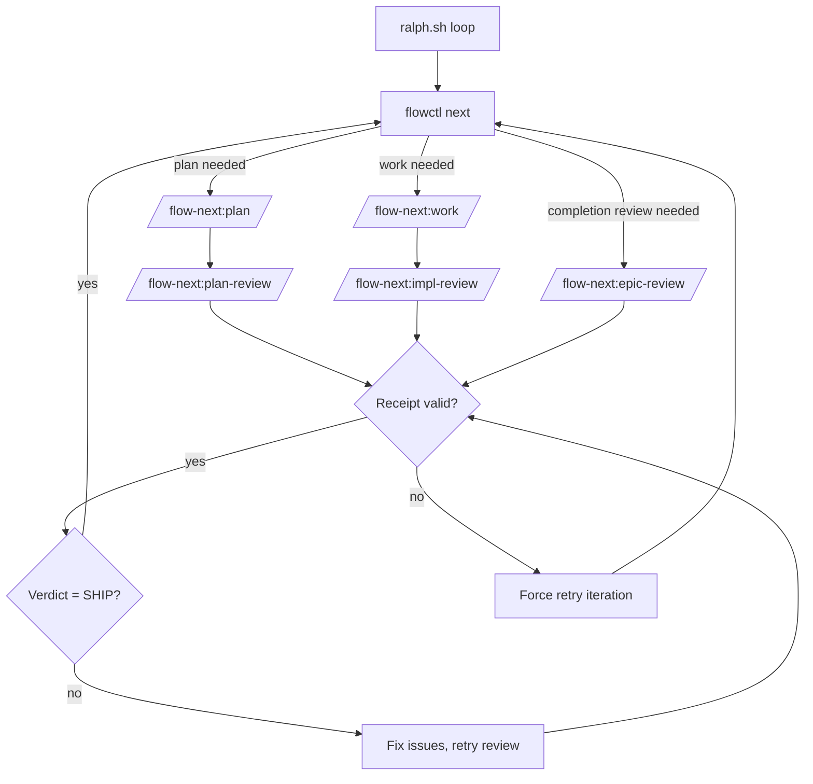

# Ralph — Autonomous Loop

Ralph is Flow-Next's repo-local autonomous harness. It loops over tasks, applies multi-model review gates, and produces production-quality code overnight.

> **TL;DR**: External shell loop → fresh Claude session per task → cross-model review gates → receipt-based proof-of-work → iterate until SHIP.

---

## Table of Contents

- [Quick Start](#quick-start)
- [Architecture](#architecture)
  - [How It Works](#how-it-works)
  - [Why Ralph vs ralph-wiggum](#why-ralph-vs-ralph-wiggum)
- [Quality Gates](#quality-gates)
  - [Multi-Model Reviews](#1-multi-model-reviews)
  - [Plan Review Gate](#plan-review-gate)
  - [Receipt-Based Gating](#2-receipt-based-gating)
  - [Review Loops Until SHIP](#3-review-loops-until-ship)
  - [Memory Capture](#4-memory-capture-opt-in)
- [Configuration Reference](#configuration-reference)
- [Review Backends](#review-backends)
  - [RepoPrompt](#repoprompt-integration)
  - [Codex CLI](#codex-integration)
- [Run Artifacts](#run-artifacts)
- [Controlling Ralph](#controlling-ralph)
- [Testing & Debugging](#testing--debugging)
- [Safety & Isolation](#safety--isolation)
  - [Docker Sandbox](#docker-sandbox)
  - [DCG (Destructive Command Guard)](#dcg-destructive-command-guard)
  - [Guard Hooks](#guard-hooks)
- [Troubleshooting](#troubleshooting)
- [Morning Review Workflow](#morning-review-workflow)

---

## Quick Start

### 1. Initialize

```bash
# Inside Claude Code
/flow-next:ralph-init

# Or from terminal
claude -p "/flow-next:ralph-init"
```

Creates `scripts/ralph/` with:

| File | Purpose |
|------|---------|
| `ralph.sh` | Main loop |
| `ralph_once.sh` | Single iteration (testing) |
| `config.env` | All settings |
| `runs/` | Artifacts and logs |

### 2. Configure

Edit `scripts/ralph/config.env`:

```bash
PLAN_REVIEW=codex   # rp, codex, or none
WORK_REVIEW=codex   # rp, codex, or none
```

### 3. Test

```bash
scripts/ralph/ralph_once.sh
```

> **Always test first.** Runs one iteration then exits. Observe before committing to a full run.

### 4. Run

```bash
scripts/ralph/ralph.sh
```

Ralph spawns Claude sessions via `claude -p`, loops until done, and applies review gates.

**Watch mode** — see activity in real-time:

```bash
scripts/ralph/ralph.sh --watch           # Tool calls only
scripts/ralph/ralph.sh --watch verbose   # Include model responses
scripts/ralph/ralph.sh --config alt.env  # Use alternate config file
```

### 5. Monitor (Optional)

```bash
bun add -g @gmickel/flow-next-tui
flow-next-tui
```

Real-time TUI for task progress, streaming logs, and run state.


### Uninstall

Run manually in terminal:

```bash
rm -rf scripts/ralph/
```

---

## Architecture

### How It Works

```
┌─────────────────────────────────────────────────────────────┐
│  scripts/ralph/ralph.sh                                      │
│  ┌────────────────────────────────────────────────────────┐  │
│  │  while flowctl next returns work:                      │  │
│  │    1. claude -p "/flow-next:plan" or :work             │  │
│  │    2. check review receipts                            │  │
│  │    3. if missing/invalid → retry                       │  │
│  │    4. if SHIP verdict → next task                      │  │
│  └────────────────────────────────────────────────────────┘  │
└─────────────────────────────────────────────────────────────┘
```



### Why Ralph vs ralph-wiggum

Anthropic's official ralph-wiggum uses a Stop hook to keep Claude in the same session. Flow-Next inverts this for production-grade reliability.

| Aspect | ralph-wiggum | Ralph |
|--------|--------------|-------|
| **Session** | Single, accumulating | Fresh per iteration |
| **Loop** | Stop hook, same session | External bash, new `claude -p` |
| **Context** | Grows until full | Clean slate every time |
| **Failed attempts** | Pollute future work | Gone with session |
| **Re-anchoring** | None | Every iteration |
| **Quality gates** | Tests only | Multi-model reviews |
| **Stuck detection** | `--max-iterations` | Auto-block after N failures |
| **Auditability** | Session transcript | Logs + receipts + evidence |

**The core problems with ralph-wiggum:**

1. **Context pollution** — Failed attempts mislead future iterations
2. **No re-anchoring** — Claude loses sight of the spec as context fills
3. **Single model** — Claude grades its own homework
4. **Binary outcome** — Completion promise or max iterations

**Ralph's solution:** Fresh context + multi-model review gates + receipt-based proof-of-work.

---

## Quality Gates

Ralph enforces quality through four mechanisms:

### 1. Multi-Model Reviews

A second model verifies code. Two models catch what one misses.

| Backend | Platform | Context | Recommended |
|---------|----------|---------|-------------|
| `rp` | macOS (GUI) | Full file context via Builder | Yes |
| `codex` | Cross-platform | Heuristic context from changed files | Fallback |
| `none` | Any | — | Not for production |

Two review types:

- **Plan reviews** — Verify architecture before coding starts
- **Impl reviews** — Verify implementation meets spec after coding

### Plan Review Gate

The plan review gate ensures epics are architecturally sound before any implementation begins. This catches design issues early when they're cheap to fix.

#### How It Works

```
┌─────────────────────────────────────────────────────────────┐
│  flowctl next --require-plan-review                         │
│  ┌────────────────────────────────────────────────────────┐ │
│  │  1. Find epics with plan_review_status = unknown       │ │
│  │  2. Return status=plan, epic=fn-1                      │ │
│  │  3. Ralph invokes /flow-next:plan-review fn-1          │ │
│  │  4. Skill loops until <verdict>SHIP</verdict>          │ │
│  │  5. flowctl epic set-plan-review-status fn-1 --status ship │
│  │  6. Next iteration: epic unlocked for work             │ │
│  └────────────────────────────────────────────────────────┘ │
└─────────────────────────────────────────────────────────────┘
```

#### Configuration

Both settings are required for plan reviews:

```bash
# config.env
REQUIRE_PLAN_REVIEW=1   # Gate: don't start work until plans reviewed
PLAN_REVIEW=codex       # Backend: rp, codex, or export
```

| `REQUIRE_PLAN_REVIEW` | `PLAN_REVIEW` | Behavior |
|-----------------------|---------------|----------|
| `0` | any | Plans auto-ship, work starts immediately |
| `1` | `rp` | Plans reviewed via RepoPrompt |
| `1` | `codex` | Plans reviewed via Codex CLI |
| `1` | `export` | Context exported for manual review |
| `1` | `none` | **Blocked forever** — no backend to review |

> **Common mistake:** Setting `REQUIRE_PLAN_REVIEW=1` without a `PLAN_REVIEW` backend. Ralph will block on every epic with no way to proceed.

#### The Review Cycle

When `flowctl next` returns `status=plan`:

1. **Checkpoint** — Save epic state before review
   ```bash
   flowctl checkpoint save --epic fn-1 --json
   ```

2. **Review** — Invoke the plan review skill
   ```bash
   /flow-next:plan-review fn-1 --review=codex
   ```

3. **Fix loop** — If `NEEDS_WORK`:
   - Parse reviewer feedback
   - Update epic spec via `flowctl epic set-plan`
   - Sync affected task specs via `flowctl task set-spec`
   - Re-review (same chat for RP, receipt continuity for Codex)
   - Repeat until `SHIP`

4. **Receipt** — Write proof-of-work
   ```json
   {"type":"plan_review","id":"fn-1","mode":"codex","timestamp":"..."}
   ```

5. **Unlock** — Set status to ship
   ```bash
   flowctl epic set-plan-review-status fn-1 --status ship
   ```

#### Recovery

If context compacts during review cycles:

```bash
flowctl checkpoint restore --epic fn-1 --json
```

This restores the epic/task state from before the review started.

#### Inspecting Plan Review Status

```bash
# Check all epics
flowctl epics --json | jq '.epics[] | {id, plan_review_status}'

# Check specific epic
flowctl show fn-1 --json | jq '.plan_review_status'

# Find epics needing review
flowctl next --require-plan-review --json
```

#### Plan Review vs Impl Review

| Aspect | Plan Review | Impl Review |
|--------|-------------|-------------|
| **When** | Before coding | After coding |
| **Reviews** | Epic + task specs | Code changes |
| **Blocks** | All tasks in epic | Single task |
| **Focus** | Architecture, feasibility, scope | Correctness, security, tests |
| **Config** | `PLAN_REVIEW` + `REQUIRE_PLAN_REVIEW` | `WORK_REVIEW` |

### Epic-Completion Review Gate

The epic-completion review gate ensures implementation matches the spec before closing an epic. Runs after all tasks complete, checking for requirement gaps.

#### How It Works

```
┌─────────────────────────────────────────────────────────────┐
│  flowctl next --require-completion-review                    │
│  ┌────────────────────────────────────────────────────────┐ │
│  │  1. All tasks done, completion_review_status != ship   │ │
│  │  2. Return status=completion_review, epic=fn-1         │ │
│  │  3. Ralph invokes /flow-next:epic-review fn-1          │ │
│  │  4. Skill loops until <verdict>SHIP</verdict>          │ │
│  │  5. flowctl epic set-completion-review-status fn-1 --status ship │
│  │  6. Next iteration: epic can close                     │ │
│  └────────────────────────────────────────────────────────┘ │
└─────────────────────────────────────────────────────────────┘
```

#### Configuration

```bash
# config.env
COMPLETION_REVIEW=codex       # Backend: rp, codex, or none
```

When `COMPLETION_REVIEW != none`, Ralph passes `--require-completion-review` to the selector. There is no separate `REQUIRE_COMPLETION_REVIEW` flag—the presence of a backend implies the gate is active.

| `COMPLETION_REVIEW` | Behavior |
|---------------------|----------|
| `rp` | Completion reviewed via RepoPrompt |
| `codex` | Completion reviewed via Codex CLI |
| `none` | No completion review, epics close immediately |

#### The Review Cycle

When `flowctl next` returns `status=completion_review`:

1. **Review** — Invoke the epic-review skill
   ```bash
   /flow-next:epic-review fn-1 --review=codex
   ```

2. **Fix loop** — If `NEEDS_WORK`:
   - Parse reviewer feedback (requirement gaps, missing functionality)
   - Implement missing requirements inline
   - Re-review (same chat for RP, receipt continuity for Codex)
   - Repeat until `SHIP`

3. **Receipt** — Skill writes proof-of-work to `receipts/completion-fn-1.json`
   ```json
   {"type":"completion_review","id":"fn-1","mode":"codex","verdict":"SHIP","timestamp":"..."}
   ```

4. **Unlock** — Set status to ship
   ```bash
   flowctl epic set-completion-review-status fn-1 --status ship
   ```

5. **Close** — Epic can now close normally

#### What Completion Review Catches

| Issue Type | Example |
|------------|---------|
| **Decomposition gaps** | Spec mentioned rate limiting, no task created |
| **Partial implementation** | Task marked done but only covers happy path |
| **Cross-task gaps** | Auth task done, logging task done, but no audit trail |
| **Missing doc updates** | Spec required README update, not done |

#### Completion Review vs Impl Review

| Aspect | Impl Review | Completion Review |
|--------|-------------|-------------------|
| **When** | After each task | After all tasks done |
| **Scope** | Single task acceptance | Entire epic spec |
| **Checks** | Code quality, tests | Spec compliance |
| **Focus** | "Is this task done right?" | "Did we deliver everything?" |
| **Config** | `WORK_REVIEW` | `COMPLETION_REVIEW` |

### 2. Receipt-Based Gating

Every review produces a receipt JSON:

```json
{
  "type": "impl_review",
  "id": "fn-1.1",
  "mode": "rp",
  "timestamp": "2026-01-09T..."
}
```

**No receipt = no progress.** Ralph retries until receipt exists.

This is at-least-once delivery. The agent is untrusted; receipts are proof-of-work.

### 3. Review Loops Until SHIP

Reviews block progress until approved:

```xml
<verdict>SHIP</verdict>
```

Fix → re-review → fix → re-review... until the reviewer approves.

**Verdict tags:**

| Verdict | Meaning |
|---------|---------|
| `<verdict>SHIP</verdict>` | Approved, proceed |
| `<verdict>NEEDS_WORK</verdict>` | Fix issues, re-review |
| `<verdict>MAJOR_RETHINK</verdict>` | Fundamental problems |

> **Common failures:**
> - Plain text "SHIP" → review skill not used correctly
> - Interactive prompt (a/b/c) → backend misconfigured
> - No verdict → check iteration log

### 4. Memory Capture (Opt-in)

When enabled, NEEDS_WORK reviews auto-capture learnings:

```bash
flowctl config set memory.enabled true
```

Builds `.flow/memory/pitfalls.md` — things reviewers catch that models miss.

> **Note:** Memory config is in `.flow/config.json`, separate from Ralph's `config.env`.

---

## Configuration Reference

Edit `scripts/ralph/config.env`:

### Reviews

| Variable | Values | Default | Description |
|----------|--------|---------|-------------|
| `PLAN_REVIEW` | `rp`, `codex`, `none` | — | Plan review backend |
| `WORK_REVIEW` | `rp`, `codex`, `none` | — | Impl review backend |
| `COMPLETION_REVIEW` | `rp`, `codex`, `none` | — | Completion review backend |
| `REQUIRE_PLAN_REVIEW` | `0`, `1` | `0` | Block work until plan approved |

### Branches

| Variable | Values | Default | Description |
|----------|--------|---------|-------------|
| `BRANCH_MODE` | `new`, `current`, `worktree` | `new` | Branch strategy |

- `new` — One branch for entire run (`ralph-<run-id>`)
- `current` — Work on current branch
- `worktree` — Git worktrees (advanced)

### Limits

| Variable | Default | Description |
|----------|---------|-------------|
| `MAX_ITERATIONS` | `25` | Total loop iterations |
| `MAX_TURNS` | ∞ | Claude turns per iteration |
| `MAX_ATTEMPTS_PER_TASK` | `5` | Retries before auto-blocking |
| `MAX_REVIEW_ITERATIONS` | `3` | Fix+re-review cycles per review |
| `WORKER_TIMEOUT` | `3600` | Seconds before killing stuck worker |

### Scope

| Variable | Example | Description |
|----------|---------|-------------|
| `EPICS` | `fn-1,fn-2` | Limit to specific epics (empty = all) |

### Permissions

| Variable | Default | Description |
|----------|---------|-------------|
| `YOLO` | `1` | Skip permission prompts |

> **Note:** `YOLO=1` is required for unattended runs. Set `YOLO=0` for interactive testing.

### Display

| Variable | Default | Description |
|----------|---------|-------------|
| `RALPH_UI` | `1` | Colored/emoji output |

### Codex-Specific

| Variable | Default | Description |
|----------|---------|-------------|
| `CODEX_SANDBOX` | `auto` | `read-only`, `workspace-write`, `danger-full-access`, `auto` |
| `FLOW_CODEX_EMBED_MAX_BYTES` | `500000` | Max bytes embedded in prompts |

> **Windows:** Use `auto` or `danger-full-access`. The `read-only` mode blocks all shell commands.

---

## Review Backends

### RepoPrompt Integration

When using `PLAN_REVIEW=rp` or `WORK_REVIEW=rp`:

```bash
flowctl rp pick-window --repo-root .  # Find window
flowctl rp builder ...                 # Build context
flowctl rp chat-send ...               # Send to reviewer
```

> **Never call `rp-cli` directly in Ralph mode.** Use flowctl wrappers.

Window selection is automatic. With RP 1.5.68+, `--create` auto-opens windows.

### Codex Integration

When using `PLAN_REVIEW=codex` or `WORK_REVIEW=codex`:

```bash
flowctl codex check                    # Verify available
flowctl codex impl-review ...          # Run impl review
flowctl codex plan-review <id> --files "src/auth.ts,src/config.ts"
```

**Requirements:**

```bash
npm install -g @openai/codex && codex auth
```

**Advantages:**
- Cross-platform (Windows, Linux, macOS)
- Terminal-based (no GUI)
- Session continuity via `thread_id`

---

## Run Artifacts

Each run creates:

```
scripts/ralph/runs/<run-id>/
├── iter-001.log           # Raw Claude output
├── iter-002.log
├── progress.txt           # Append-only run log
├── attempts.json          # Per-task retry counts
├── branches.json          # Branch info
├── receipts/
│   ├── plan-fn-1.json        # Plan review receipt
│   ├── impl-fn-1.1.json      # Impl review receipt
│   └── completion-fn-1.json  # Completion review receipt
└── block-fn-1.2.md        # Written when task auto-blocked
```

---

## Controlling Ralph

### CLI Commands

```bash
flowctl status                    # Epic/task counts + active runs
flowctl ralph pause               # Pause run
flowctl ralph resume              # Resume run
flowctl ralph stop                # Graceful stop
flowctl ralph status              # Show run state
flowctl ralph pause --run <id>    # Specify run when multiple active
```

### Sentinel Files

```bash
# Pause
touch scripts/ralph/runs/<run-id>/PAUSE

# Resume
rm scripts/ralph/runs/<run-id>/PAUSE

# Stop (kept for audit)
touch scripts/ralph/runs/<run-id>/STOP
```

Ralph checks sentinels at iteration boundaries.

### Task Retry/Rollback

```bash
flowctl unblock fn-1.2                    # Re-enable blocked task
flowctl update fn-1.2 --status pending    # Reset to pending
```

---

## Testing & Debugging

### Single Iteration

```bash
scripts/ralph/ralph_once.sh
```

Runs one iteration then exits. Verify setup before full runs.

### Watch Mode

```bash
scripts/ralph/ralph.sh --watch           # Tool calls
scripts/ralph/ralph.sh --watch verbose   # Include responses
```

Real-time visibility without blocking autonomy.

### Custom Config

```bash
scripts/ralph/ralph.sh --config my-codex-config.env
scripts/ralph/ralph.sh --watch --config rp-reviews.env
```

Use alternate config files for different platforms or review backends without editing `config.env`. Useful for:
- Separate configs for RepoPrompt vs Codex reviews
- Platform-specific settings (macOS vs Linux vs Windows)
- Testing different `MAX_ITERATIONS` or `WORKER_TIMEOUT` values

### Verbose Logging

```bash
FLOW_RALPH_VERBOSE=1 scripts/ralph/ralph.sh
```

Detailed logs → `scripts/ralph/runs/<run>/ralph.log`

### Debug Environment Variables

```bash
FLOW_RALPH_CLAUDE_MODEL=claude-opus-4-5-20251101
FLOW_RALPH_CLAUDE_DEBUG=hooks
FLOW_RALPH_CLAUDE_PERMISSION_MODE=bypassPermissions
```

---

## Safety & Isolation

### Docker Sandbox

Run Ralph inside Docker for isolation:

```bash
docker sandbox run claude "scripts/ralph/ralph.sh"
docker sandbox run -w ~/my-project claude "scripts/ralph/ralph.sh"
```

See [Docker sandbox docs](https://docs.docker.com/ai/sandboxes/claude-code/).

**Community sandbox setups:**

- [devcontainer-for-claude-yolo-and-flow-next](https://github.com/Ranudar/devcontainer-for-claude-yolo-and-flow-next) — VS Code devcontainer with Playwright, firewall whitelisting, RepoPrompt MCP bridge
- [agent-sandbox](https://github.com/novotnyllc/agent-sandbox) — Docker Sandbox (Desktop 4.50+) with seccomp/namespace isolation

### DCG (Destructive Command Guard)

[DCG](https://github.com/Dicklesworthstone/destructive_command_guard) blocks destructive commands before execution.

**What it blocks:**

| Command | Without DCG | With DCG |
|---------|-------------|----------|
| `git reset --hard` | Loses work | Blocked |
| `rm -rf ./src` | Deletes source | Blocked |
| `git push --force` | Overwrites history | Blocked |
| `git clean -f` | Deletes files | Blocked |

**Install:**

```bash
curl -fsSL "https://raw.githubusercontent.com/Dicklesworthstone/destructive_command_guard/master/install.sh?$(date +%s)" | bash -s -- --easy-mode
```

**Compatibility:** DCG uses fail-open design — timeouts allow commands. Flow-next uses safe git patterns and quoted heredocs that DCG handles correctly.

> **Note:** DCG will block `rm -rf .flow/` and `rm -rf scripts/ralph/` — this is correct behavior. Uninstall commands should be run manually, not via AI agents. Your epics and tasks are protected.

**Verify:**

```bash
dcg test 'git reset --hard HEAD'    # Should block
dcg test 'git checkout -b feature'  # Should allow
```

**Uninstall:**

```bash
rm ~/.local/bin/dcg
# Edit ~/.claude/settings.json to remove dcg hook
rm -rf ~/.config/dcg/
```

**More info:** [DCG GitHub](https://github.com/Dicklesworthstone/destructive_command_guard) · [Pack Reference](https://github.com/Dicklesworthstone/destructive_command_guard/blob/master/docs/packs/README.md)

### Guard Hooks

Plugin hooks enforce workflow rules deterministically.

> **Only active when `FLOW_RALPH=1`** — zero overhead for non-Ralph users.

| Rule | Purpose |
|------|---------|
| No `--json` on chat-send | Preserve review text output |
| No `--new-chat` on re-reviews | Keep conversation context |
| Receipt before Stop | Prevent skipping reviews |
| Required flags on setup | Ensure proper targeting |

**Location:**

```
plugins/flow-next/
  hooks/hooks.json              # Config
  scripts/hooks/ralph-guard.py  # Logic
```

**Disable temporarily:** Unset `FLOW_RALPH`

**Disable permanently:** Delete `hooks/` directory

---

## Troubleshooting

### Plan Review Never Starts

**Symptoms:** Ralph exits with `NO_WORK` but epics have `plan_review_status: unknown`.

**Check config:**

```bash
grep -E "REQUIRE_PLAN_REVIEW|PLAN_REVIEW" scripts/ralph/config.env
```

**Common causes:**

| Config | Problem | Fix |
|--------|---------|-----|
| `REQUIRE_PLAN_REVIEW=0` | Plan gate disabled | Set to `1` |
| `PLAN_REVIEW=none` + `REQUIRE_PLAN_REVIEW=1` | No backend to review | Set `PLAN_REVIEW=codex` or `rp` |
| `PLAN_REVIEW` unset | Defaults to template placeholder | Set explicitly |

**Verify selector sees plan work:**

```bash
flowctl next --require-plan-review --json
```

Should return `status: "plan"` if epics need review.

### Plan Review Blocked Forever

**Symptoms:** Ralph loops on plan review, never progresses to work.

**Check:**

```bash
# What's the epic status?
flowctl show fn-1 --json | jq '.plan_review_status'

# Is there a receipt?
ls scripts/ralph/runs/*/receipts/plan-fn-1.json

# What verdict did we get?
grep -i verdict scripts/ralph/runs/*/iter-*.log | grep plan
```

**Common causes:**
- `PLAN_REVIEW=none` with `REQUIRE_PLAN_REVIEW=1` → blocked forever
- Review returns `NEEDS_WORK` repeatedly → plan has fundamental issues
- No verdict tag in response → backend misconfigured

**Fix:** Either set a review backend or disable the gate:

```bash
# Option A: Enable codex reviews
PLAN_REVIEW=codex

# Option B: Disable gate (plans auto-ship)
REQUIRE_PLAN_REVIEW=0
```

### Dependent Epics Not Starting

**Symptoms:** Epic A completes, but Epic B (depends on A) never starts.

**Check:**

```bash
# Is A actually closed?
flowctl show fn-1 --json | jq '.status'

# Does B depend on A?
flowctl show fn-2 --json | jq '.depends_on_epics'
```

**Common cause:** Race condition — selector runs before `maybe_close_epics()`. Fixed in v0.18.23+.

**Workaround for older versions:**

```bash
# Manually close the epic
flowctl epic close fn-1 --json

# Re-run Ralph
scripts/ralph/ralph.sh
```

### Review Gate Loops

**Symptoms:** Ralph keeps retrying the same task.

**Check receipts:**

```bash
ls scripts/ralph/runs/*/receipts/
```

**Check verdict:**

```bash
grep -i verdict scripts/ralph/runs/*/iter-*.log | tail -5
```

**Common causes:**
- No receipt file → review skill not invoked
- Wrong verdict format → plain text instead of XML tags
- Receipt exists but verdict is NEEDS_WORK → implementation has issues

### Auto-Blocked Tasks

After `MAX_ATTEMPTS_PER_TASK` failures:

1. Ralph writes `block-<task>.md` with context
2. Marks task blocked via `flowctl block`
3. Moves to next task

**To retry:**

```bash
flowctl unblock fn-1.2
```

### RepoPrompt Issues

**"rp-cli not found":**

```bash
# Install RepoPrompt, then:
which rp-cli
```

**Window not found:**

- RP 1.5.68+: Use `--create` flag
- Older: Open RepoPrompt on your repo manually

**Alternative:** Switch to Codex backend.

### Codex Issues

**"codex not found":**

```bash
npm install -g @openai/codex
codex auth
```

**Windows "blocked by policy":**

```bash
# In config.env:
CODEX_SANDBOX=auto
```

The `read-only` sandbox blocks all commands on Windows.

### Run Inspection

```bash
# Progress
cat scripts/ralph/runs/*/progress.txt

# Latest iteration
tail -100 scripts/ralph/runs/*/iter-*.log | tail -1

# Blocked tasks
ls scripts/ralph/runs/*/block-*.md
```

---

## Morning Review Workflow

After overnight runs, review and merge the work.

### 1. Check Completion

```bash
# Run status
cat scripts/ralph/runs/*/progress.txt | tail -5

# Blocked tasks
ls scripts/ralph/runs/*/block-*.md 2>/dev/null

# Pending tasks
flowctl ready --json
```

**Partial run?** Review `block-*.md`, fix issues, re-run `ralph.sh` (resumes from pending).

### 2. Review Changes

```bash
# Summary
cat scripts/ralph/runs/*/progress.txt

# All reviews passed
ls scripts/ralph/runs/*/receipts/

# Commits
git log --oneline
```

### 3. Review by Epic

Commits include task IDs (`feat(fn-1.1): ...`):

```bash
git log --oneline --grep="fn-1"
git log --oneline --grep="fn-2"
```

### 4. Merge

**All good:**

```bash
git checkout main
git merge ralph-<run-id>
# Or: gh pr create
```

**One epic is bad — cherry-pick good ones:**

```bash
git checkout main
git cherry-pick <fn-1-commits>
git cherry-pick <fn-2-commits>
# Skip fn-3
```

**One epic is bad — revert and merge:**

```bash
git checkout ralph-<run-id>
git revert <fn-3-commits>
git checkout main
git merge ralph-<run-id>
```

### 5. Find Commit SHAs

```bash
git log --oneline --grep="fn-1"
flowctl show fn-1.1 --json | jq '.evidence.commits'
```

---

## References

- [flowctl CLI](flowctl.md)
- [Flow-Next README](../README.md)
- [flow-next-tui](../../../flow-next-tui/README.md)
- Test scripts: `plugins/flow-next/scripts/ralph_e2e_*.sh`
