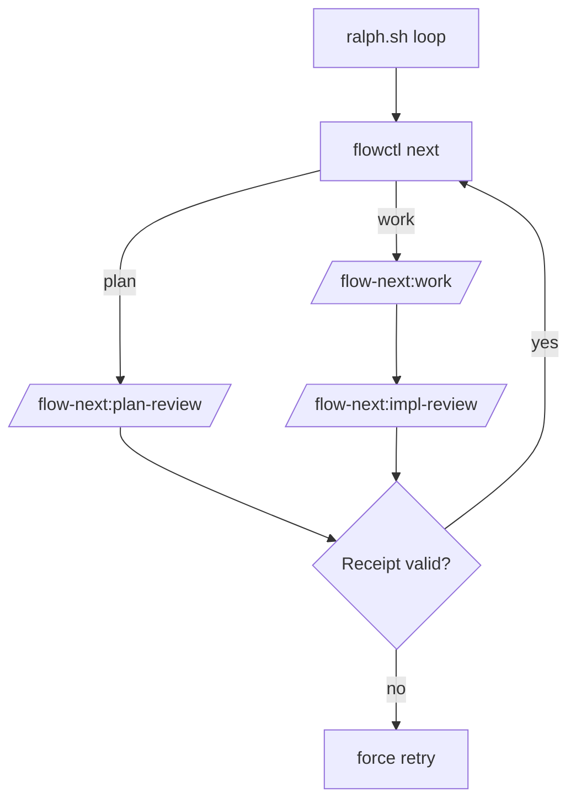

# Ralph (Autonomous Loop)

Ralph is Flow-Next's repo-local autonomous harness. It plans, executes tasks, and applies review gates without external services.

**Requires Claude Code 2.1.0+** (skill-scoped hooks).

## Enable Ralph

```bash
/flow-next:ralph-init
```

This scaffolds `scripts/ralph/` in your repo. Then run:

```bash
scripts/ralph/ralph.sh
```

To uninstall Ralph: delete `scripts/ralph/`.

---

## How It Works (High Level)

Ralph loops over `flowctl next` and handles each unit:



Key points:
- **Plan gate:** uses `/flow-next:plan-review` when configured.
- **Work gate:** uses `/flow-next:impl-review` when configured.
- **Receipts:** Ralph trusts receipt JSON files, not stdout.

---

## Receipts (Review Gates)

When review mode is `rp`, Ralph passes a `REVIEW_RECEIPT_PATH` env var to the review skills. The skills **must** write a receipt after the review returns (any verdict).
Ralph also sets `RALPH_MODE=1` to enable stricter skill rules and anti-drift guards.

Receipt files live under:

```
scripts/ralph/runs/<run-id>/receipts/
  plan-<epic>.json
  impl-<task>.json
```

Receipt schema:

```json
{"type":"plan_review","id":"fn-1","mode":"rp","timestamp":"2026-01-07T22:07:15Z","chat":"<optional>"}
```

```json
{"type":"impl_review","id":"fn-1.1","mode":"rp","timestamp":"2026-01-07T22:07:15Z","chat":"<optional>"}
```

Ralph behavior:
- **Missing/invalid receipt** → forces retry.
- **Plan review missing receipt** → sets plan_review_status to `needs_work`.

---

## Run Artifacts

Each run creates a folder:

```
scripts/ralph/runs/<run-id>/
  iter-###.log
  attempts.json
  branches.json
  receipts/
  block-<task>.md   # after max attempts
```

- `iter-###.log`: raw Claude output per iteration.
- `attempts.json`: per-task retry counts.
- `branches.json`: epic → branch mapping (branch mode = new).
- `receipts/`: plan/impl receipts.

---

## Review Integration (RepoPrompt)

Ralph uses the plan/impl review skills, which:
- build context with RepoPrompt **builder** via `flowctl rp` wrappers
- send chat via `flowctl rp chat-send`
- never call `rp-cli` directly in Ralph mode
- write receipts if `REVIEW_RECEIPT_PATH` is set
These rules are enforced by skill-scoped hooks (no global impact).

**RepoPrompt window selection** is automatic by repo root via `flowctl rp pick-window`.

If rp-cli is unavailable, review mode must be `none` or Ralph will retry.

### Verbose logging (optional)

Set `FLOW_RALPH_VERBOSE=1` before running to append hook logs:
`scripts/ralph/runs/<run>/ralph.log`

---

## Config (scripts/ralph/config.env)

Common knobs:

- `PLAN_REVIEW=rp|export|none`
- `WORK_REVIEW=rp|export|none`
- `REQUIRE_PLAN_REVIEW=1|0`
- `BRANCH_MODE=new|current|worktree`
- `MAX_ITERATIONS=25`
- `MAX_TURNS=50`
- `MAX_ATTEMPTS_PER_TASK=5`
- `YOLO=1` (passes `--dangerously-skip-permissions`)
- `EPICS=fn-1,fn-2` (optional scope limiter)

---

## Troubleshooting

**Plan gate loops / retries**
- Check receipt exists and matches type/id.
- Inspect `scripts/ralph/runs/<run>/iter-*.log`.

**Impl gate loops / retries**
- Ensure impl receipt written (any verdict).
- Gate only passes when verdict tag is `<verdict>SHIP</verdict>`.

**Auto-blocked tasks**
- After `MAX_ATTEMPTS_PER_TASK`, Ralph writes `block-<task>.md` and marks task blocked.

---

## References

- [flowctl CLI](flowctl.md)
- `plugins/flow-next/scripts/ralph_e2e_rp_test.sh` (rp-cli e2e)
- `plugins/flow-next/scripts/ralph_e2e_test.sh` (no-review e2e)
