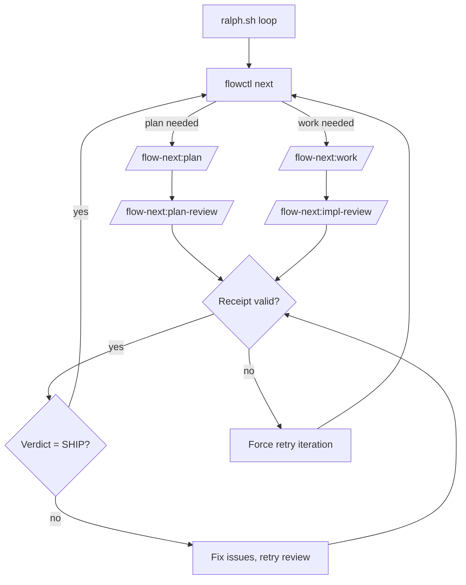

# Ralph (Autonomous Loop)

Ralph is Flow-Next's repo-local autonomous harness. It loops over tasks, applies multi-model review gates, and produces production-quality code overnight.

---

## Quick Start

### Step 1: Setup (inside Claude)

Run the init skill from Claude Code:

```bash
/flow-next:ralph-init
```

Or run setup from terminal without entering Claude:

```bash
claude -p "/flow-next:ralph-init"
```

This scaffolds `scripts/ralph/` with:
- `ralph.sh` — main loop
- `ralph_once.sh` — single iteration (for testing)
- `config.env` — all settings
- `runs/` — artifacts and logs

### Step 2: Run (outside Claude)

```bash
scripts/ralph/ralph.sh
```

Ralph spawns Claude sessions via `claude -p`, loops until done, and applies review gates.

### Step 3: Uninstall

```bash
rm -rf scripts/ralph/
```

---

## How It Works

Ralph wraps Claude Code in a shell loop with quality gates:

```
┌─────────────────────────────────────────────────────────┐
│  scripts/ralph/ralph.sh                                 │
│  ┌──────────────────────────────────────────────────┐   │
│  │ while flowctl next returns work:                 │   │
│  │   1. claude -p "/flow-next:plan" or :work        │   │
│  │   2. check review receipts                       │   │
│  │   3. if missing/invalid → retry                  │   │
│  │   4. if SHIP verdict → next task                 │   │
│  └──────────────────────────────────────────────────┘   │
└─────────────────────────────────────────────────────────┘
```



---

## Quality Gates

Ralph enforces quality through three mechanisms:

### 1. Multi-Model Reviews

Reviews use [RepoPrompt](https://repoprompt.com/?atp=KJbuL4) to send code to a *different* model. Two models catch what one misses.

- Plan reviews verify architecture and edge cases before coding starts
- Impl reviews verify the implementation meets spec after each task

### 2. Receipt-Based Gating

Every review must produce a receipt JSON proving it ran:

```json
{"type":"impl_review","id":"fn-1.1","mode":"rp","timestamp":"2026-01-09T..."}
```

No receipt = no progress. Ralph retries until receipt exists.

This is the same at-least-once delivery protocol used in distributed systems. Treats the agent as an untrusted actor; receipts are proof-of-work.

### 3. Review Loops Until SHIP

Reviews don't just flag issues—they block progress. The cycle repeats until:

```
<verdict>SHIP</verdict>
```

Fix → re-review → fix → re-review... until the reviewer approves.

### 4. Memory Capture (Opt-in)

When memory is enabled (`flowctl config set memory.enabled true`), NEEDS_WORK reviews auto-capture learnings to `.flow/memory/pitfalls.md`.

This builds a project-specific knowledge base of things reviewers catch that models tend to miss.

**Note**: Memory config lives in `.flow/config.json`, separate from Ralph's `scripts/ralph/config.env`. Memory is a flow-next feature that works in both manual and Ralph modes.

---

## Configuration

Edit `scripts/ralph/config.env`:

### Review Settings

| Variable | Values | Description |
|----------|--------|-------------|
| `PLAN_REVIEW` | `rp`, `none` | How to review plans (rp = RepoPrompt) |
| `WORK_REVIEW` | `rp`, `none` | How to review implementations |
| `REQUIRE_PLAN_REVIEW` | `1`, `0` | Block work until plan review passes |

### Branch Settings

| Variable | Values | Description |
|----------|--------|-------------|
| `BRANCH_MODE` | `new`, `current`, `worktree` | How to handle git branches |

- `new` — create one branch for the entire Ralph run (`ralph-<run-id>`)
- `current` — work on current branch
- `worktree` — use git worktrees (advanced)

With `BRANCH_MODE=new`, all epics work on the same run branch. Commits are prefixed with task IDs (e.g., `feat(fn-1.1): ...`) for easy identification. This enables cherry-picking or reverting individual epics post-run.

### Limits

| Variable | Default | Description |
|----------|---------|-------------|
| `MAX_ITERATIONS` | `25` | Total loop iterations |
| `MAX_TURNS` | (empty) | Claude turns per iteration (empty = unlimited) |
| `MAX_ATTEMPTS_PER_TASK` | `5` | Retries before auto-blocking task |

### Scope

| Variable | Example | Description |
|----------|---------|-------------|
| `EPICS` | `fn-1,fn-2` | Limit to specific epics (empty = all) |

### Permissions

| Variable | Default | Effect |
|----------|---------|--------|
| `YOLO` | `1` | Passes `--dangerously-skip-permissions` to Claude |

Note: `-p` mode is headless but still prompts for file/command permissions. `YOLO=1` (the default) is required for truly unattended runs. Set `YOLO=0` for interactive testing.

### Display

| Variable | Default | Description |
|----------|---------|-------------|
| `RALPH_UI` | `1` | Colored/emoji output (0 = plain) |

---

## Run Artifacts

Each run creates:

```
scripts/ralph/runs/<run-id>/
  ├── iter-001.log          # Raw Claude output
  ├── iter-002.log
  ├── progress.txt          # Append-only run log
  ├── attempts.json         # Per-task retry counts
  ├── branches.json         # Run branch info (base_branch, run_branch)
  ├── receipts/
  │   ├── plan-fn-1.json    # Plan review receipt
  │   └── impl-fn-1.1.json  # Impl review receipt
  └── block-fn-1.2.md       # Written when task exceeds MAX_ATTEMPTS
```

---

## RepoPrompt Integration

Ralph uses `flowctl rp` wrappers for all RepoPrompt operations:

```bash
flowctl rp pick-window --repo-root .  # Find window by repo
flowctl rp builder ...                 # Build context
flowctl rp chat-send ...               # Send to reviewer
```

Never call `rp-cli` directly in Ralph mode.

**Window selection** is automatic by repo root. RepoPrompt must have a window open on your project.

---

## Troubleshooting

### Plan gate loops / retries

- Check receipt exists: `ls scripts/ralph/runs/*/receipts/plan-*.json`
- Verify type/id match expected epic
- Inspect logs: `cat scripts/ralph/runs/*/iter-*.log`

### Impl gate loops / retries

- Check receipt exists: `ls scripts/ralph/runs/*/receipts/impl-*.json`
- Gate only passes when verdict is `<verdict>SHIP</verdict>`
- Check progress: `cat scripts/ralph/runs/*/progress.txt`

### Auto-blocked tasks

After `MAX_ATTEMPTS_PER_TASK` failures, Ralph:
1. Writes `block-<task>.md` with failure context
2. Marks task blocked via `flowctl block`
3. Moves to next task

### RepoPrompt not found

Ensure rp-cli is installed and RepoPrompt window is open on your repo.

If rp-cli unavailable, set `PLAN_REVIEW=none` and `WORK_REVIEW=none`.

---

## Testing Ralph

### Single iteration (observe before committing)

```bash
scripts/ralph/ralph_once.sh
```

Runs one loop iteration, then exits. Good for verifying setup.

### Sandbox mode (recommended for unattended runs)

Run Ralph inside Docker sandbox for extra isolation:

```bash
# From your project directory
docker sandbox run claude "scripts/ralph/ralph.sh"

# Or specify workspace explicitly
docker sandbox run -w ~/my-project claude "scripts/ralph/ralph.sh"
```

See [Docker sandbox docs](https://docs.docker.com/ai/sandboxes/claude-code/) for details.

### Verbose logging

```bash
FLOW_RALPH_VERBOSE=1 scripts/ralph/ralph.sh
```

Appends detailed logs to `scripts/ralph/runs/<run>/ralph.log`.

### Debug environment variables

```bash
FLOW_RALPH_CLAUDE_MODEL=claude-opus-4-5-20251101  # Force model
FLOW_RALPH_CLAUDE_DEBUG=hooks                     # Debug hooks
FLOW_RALPH_CLAUDE_PERMISSION_MODE=bypassPermissions
```

---

## Guard Hooks

Ralph includes plugin hooks that enforce workflow rules deterministically.

**Only active when `FLOW_RALPH=1`** — non-Ralph users see zero overhead.

### What hooks enforce

| Rule | Why |
|------|-----|
| No `--json` on chat-send | Preserves review text output |
| No `--new-chat` on re-reviews | First review creates chat, subsequent stay in same |
| Receipt must exist before Stop | Blocks Claude from stopping without writing receipt |
| Required flags on setup/select-add | Ensures proper window/tab targeting |

### Hook location

```
plugins/flow-next/
  hooks/hooks.json              # Hook config
  scripts/hooks/ralph-guard.py  # Guard logic
```

### Disabling hooks

Temporarily: unset `FLOW_RALPH` or remove `hooks/hooks.json`.

Permanently: delete `hooks/` directory and remove `"hooks"` from `plugin.json`.

---

## References

- [flowctl CLI reference](flowctl.md)
- [Flow-Next README](../README.md)
- Test scripts:
  - Full: `plugins/flow-next/scripts/ralph_e2e_rp_test.sh`
  - Short (2 tasks): `plugins/flow-next/scripts/ralph_e2e_short_rp_test.sh`
