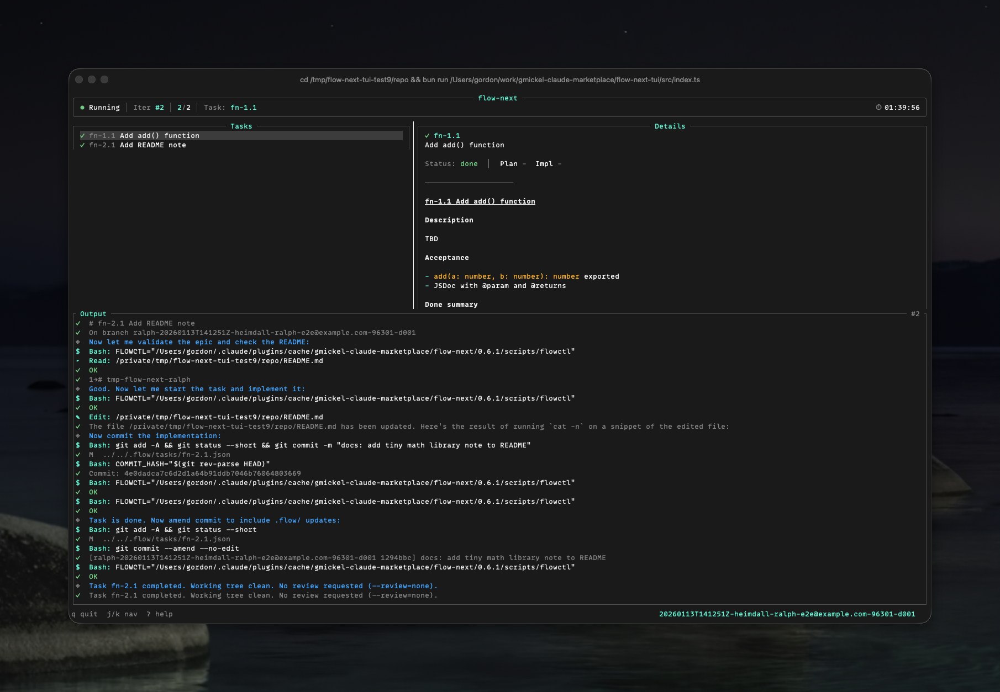
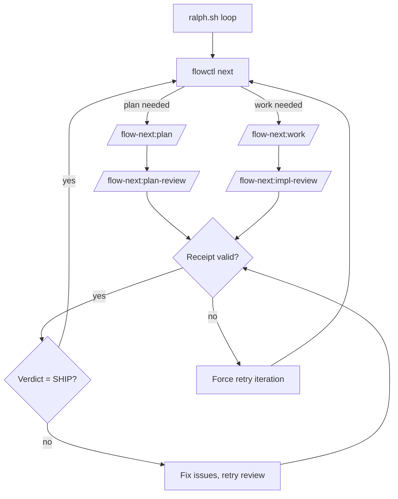

# Ralph (Autonomous Loop)

Ralph is Flow-Next's repo-local autonomous harness. It loops over tasks, applies multi-model review gates, and produces production-quality code overnight.

## Table of Contents

- [Quick Start](#quick-start) — Setup, configure, run
- [How It Works](#how-it-works) — Loop architecture
- [Why Ralph vs ralph-wiggum](#why-flow-next-ralph-vs-anthropics-ralph-wiggum)
- [Quality Gates](#quality-gates) — Reviews, receipts, memory
- [Configuration](#configuration) — All config.env options
- [Run Artifacts](#run-artifacts) — Logs, receipts, blocks
- [RepoPrompt Integration](#repoprompt-integration)
- [Codex Integration](#codex-integration)
- [Troubleshooting](#troubleshooting)
- [Testing Ralph](#testing-ralph) — Single iteration, sandbox, watch mode
- [Guard Hooks](#guard-hooks) — Workflow enforcement
- [Morning Review Workflow](#morning-review-workflow) — What to check after overnight runs

---

## Quick Start

### Step 1: Setup (inside Claude)

Run the init skill from Claude Code:

```bash
/flow-next:ralph-init
```

Or run setup from terminal without entering Claude:

```bash
claude -p "/flow-next:ralph-init"
```

This scaffolds `scripts/ralph/` with:
- `ralph.sh` — main loop
- `ralph_once.sh` — single iteration (for testing)
- `config.env` — all settings
- `runs/` — artifacts and logs

### Step 1.5: Configure (edit config.env)

Before running, set your review backends in `scripts/ralph/config.env`:

```bash
PLAN_REVIEW=codex   # or: rp, none
WORK_REVIEW=codex   # or: rp, none
```

See [Configuration](#configuration) for all options.

### Step 1.75: Test First (Recommended)

```bash
scripts/ralph/ralph_once.sh
```

Runs ONE iteration then exits. Observe the output before committing to a full run.

### Step 2: Run (outside Claude)

```bash
scripts/ralph/ralph.sh
```

Ralph spawns Claude sessions via `claude -p`, loops until done, and applies review gates.

**Watch mode** - see what's happening in real-time:
```bash
scripts/ralph/ralph.sh --watch           # Stream tool calls
scripts/ralph/ralph.sh --watch verbose   # Also stream model responses
```

### Step 2.5: Monitor with TUI (Optional)

```bash
# Install TUI (requires Bun)
bun add -g @gmickel/flow-next-tui

# Start TUI (auto-selects latest run)
flow-next-tui
```

Real-time visibility into task progress, streaming logs, and run state.



See [flow-next-tui README](../../../flow-next-tui/README.md).

### Step 3: Uninstall

```bash
rm -rf scripts/ralph/
```

---

## How It Works

Ralph wraps Claude Code in a shell loop with quality gates:

```
┌─────────────────────────────────────────────────────────┐
│  scripts/ralph/ralph.sh                                 │
│  ┌──────────────────────────────────────────────────┐   │
│  │ while flowctl next returns work:                 │   │
│  │   1. claude -p "/flow-next:plan" or :work        │   │
│  │   2. check review receipts                       │   │
│  │   3. if missing/invalid → retry                  │   │
│  │   4. if SHIP verdict → next task                 │   │
│  └──────────────────────────────────────────────────┘   │
└─────────────────────────────────────────────────────────┘
```



---

## Why Flow-Next Ralph vs Anthropic's ralph-wiggum?

Anthropic's official ralph-wiggum plugin uses a Stop hook to keep Claude in the same session. Flow-Next inverts this architecture for production-grade reliability.

| Aspect | ralph-wiggum | Flow-Next Ralph |
|--------|--------------|-----------------|
| **Session model** | Single session, accumulating context | Fresh context per iteration |
| **Loop mechanism** | Stop hook re-feeds prompt in SAME session | External bash loop, new `claude -p` each iteration |
| **Context management** | Transcript grows, context fills up | Clean slate every time |
| **Failed attempts** | Pollute future iterations | Gone with the session |
| **Re-anchoring** | None | Re-reads epic/task spec EVERY iteration |
| **Quality gates** | None (test-based only) | Multi-model reviews block until SHIP |
| **Stuck detection** | `--max-iterations` safety limit | Auto-blocks task after N failures |
| **State storage** | In-memory transcript | File I/O (`.flow/`, receipts, evidence) |
| **Auditability** | Session transcript | Per-iteration logs + receipts + evidence |

**The Core Problem with ralph-wiggum**

1. **Context pollution** - Every failed attempt stays in context, potentially misleading future iterations
2. **No re-anchoring** - As context fills, Claude loses sight of the original task spec
3. **Single model** - No external validation; Claude grades its own homework
4. **Binary outcome** - Either completion promise triggers, or you hit max iterations

**Flow-Next's Solution**

Fresh context every iteration + multi-model review gates + receipt-based proof-of-work.

Two models catch what one misses. Process failures, not model failures.

---

## Quality Gates

Ralph enforces quality through three mechanisms:

### 1. Multi-Model Reviews

Reviews use a second model to verify code. Two models catch what one misses.

**Review backends:**
- `rp` — [RepoPrompt](https://repoprompt.com/?atp=KJbuL4) (macOS only, GUI-based) **← recommended**
- `codex` — OpenAI Codex CLI (cross-platform, terminal-based)
- `none` — skip reviews (not recommended for production)

**We recommend RepoPrompt** when available. Its Builder provides full file context with intelligent selection, while Codex uses heuristic context hints from changed files. Both use the same Carmack-level review criteria.

- Plan reviews verify architecture and edge cases before coding starts
- Impl reviews verify the implementation meets spec after each task

### 2. Receipt-Based Gating

Every review must produce a receipt JSON proving it ran:

```json
{"type":"impl_review","id":"fn-1.1","mode":"rp","timestamp":"2026-01-09T..."}
```

No receipt = no progress. Ralph retries until receipt exists.

This is the same at-least-once delivery protocol used in distributed systems. Treats the agent as an untrusted actor; receipts are proof-of-work.

### 3. Review Loops Until SHIP

Reviews don't just flag issues—they block progress. The cycle repeats until:

```
<verdict>SHIP</verdict>
```

Fix -> re-review -> fix -> re-review... until the reviewer approves.

#### Verdict Format

Reviews MUST return XML verdict tags:
- `<verdict>SHIP</verdict>` - approved, proceed to next task
- `<verdict>NEEDS_WORK</verdict>` - fix issues, re-review in same chat
- `<verdict>MAJOR_RETHINK</verdict>` - fundamental problems, blocks progress

**Common failures:**
- Plain text "SHIP" or "Approved" -> review skill wasn't used correctly
- Interactive prompt (a/b/c) -> review backend misconfigured
- No verdict in response -> check iteration log for errors

### 4. Memory Capture (Opt-in)

When memory is enabled (`flowctl config set memory.enabled true`), NEEDS_WORK reviews auto-capture learnings to `.flow/memory/pitfalls.md`.

This builds a project-specific knowledge base of things reviewers catch that models tend to miss.

**Note**: Memory config lives in `.flow/config.json`, separate from Ralph's `scripts/ralph/config.env`. Memory is a flow-next feature that works in both manual and Ralph modes.

---

## Configuration

Edit `scripts/ralph/config.env`:

### Review Settings

| Variable | Values | Description |
|----------|--------|-------------|
| `PLAN_REVIEW` | `rp`, `codex`, `none` | How to review plans |
| `WORK_REVIEW` | `rp`, `codex`, `none` | How to review implementations |
| `REQUIRE_PLAN_REVIEW` | `1`, `0` | Block work until plan review passes |

- `rp` — RepoPrompt (macOS, requires GUI)
- `codex` — OpenAI Codex CLI (cross-platform, terminal-based)
- `none` — skip reviews

### Branch Settings

| Variable | Values | Description |
|----------|--------|-------------|
| `BRANCH_MODE` | `new`, `current`, `worktree` | How to handle git branches |

- `new` — create one branch for the entire Ralph run (`ralph-<run-id>`)
- `current` — work on current branch
- `worktree` — use git worktrees (advanced)

With `BRANCH_MODE=new`, all epics work on the same run branch. Commits are prefixed with task IDs (e.g., `feat(fn-1.1): ...`) for easy identification. This enables cherry-picking or reverting individual epics post-run.

### Limits

| Variable | Default | Description |
|----------|---------|-------------|
| `MAX_ITERATIONS` | `25` | Total loop iterations |
| `MAX_TURNS` | (empty) | Claude turns per iteration (empty = unlimited) |
| `MAX_ATTEMPTS_PER_TASK` | `5` | Retries before auto-blocking task |
| `MAX_REVIEW_ITERATIONS` | `3` | Fix+re-review cycles within one impl-review |
| `WORKER_TIMEOUT` | `3600` | Seconds before killing stuck worker (1hr safety guard) |

### Scope

| Variable | Example | Description |
|----------|---------|-------------|
| `EPICS` | `fn-1,fn-2` | Limit to specific epics (empty = all) |

### Permissions

| Variable | Default | Effect |
|----------|---------|--------|
| `YOLO` | `1` | Passes `--dangerously-skip-permissions` to Claude |

Note: `-p` mode is headless but still prompts for file/command permissions. `YOLO=1` (the default) is required for truly unattended runs. Set `YOLO=0` for interactive testing.

### Display

| Variable | Default | Description |
|----------|---------|-------------|
| `RALPH_UI` | `1` | Colored/emoji output (0 = plain) |

### Codex Settings

| Variable | Values | Default | Description |
|----------|--------|---------|-------------|
| `CODEX_SANDBOX` | `read-only`, `workspace-write`, `danger-full-access`, `auto` | `auto` | Codex CLI sandbox mode |
| `FLOW_CODEX_EMBED_MAX_BYTES` | integer bytes | `500000` | Total bytes of file contents embedded in Codex review prompts (diff excluded). Set to `0` for unlimited. |

- `read-only` — Can only read files (Unix default, **blocks all operations on Windows**)
- `workspace-write` — Can write files in workspace
- `danger-full-access` — Full file system access
- `auto` — Resolves to `danger-full-access` on Windows, `read-only` on Unix

**Windows users:** Use `auto` (default) or `danger-full-access`. The `read-only` mode blocks ALL shell commands on Windows, including file reads.

---

## Run Artifacts

Each run creates:

```
scripts/ralph/runs/<run-id>/
  ├── iter-001.log          # Raw Claude output
  ├── iter-002.log
  ├── progress.txt          # Append-only run log
  ├── attempts.json         # Per-task retry counts
  ├── branches.json         # Run branch info (base_branch, run_branch)
  ├── receipts/
  │   ├── plan-fn-1.json    # Plan review receipt
  │   └── impl-fn-1.1.json  # Impl review receipt
  └── block-fn-1.2.md       # Written when task exceeds MAX_ATTEMPTS
```

---

## RepoPrompt Integration

When `PLAN_REVIEW=rp` or `WORK_REVIEW=rp`, Ralph uses `flowctl rp` wrappers:

```bash
flowctl rp pick-window --repo-root .  # Find window by repo
flowctl rp builder ...                 # Build context
flowctl rp chat-send ...               # Send to reviewer
```

Never call `rp-cli` directly in Ralph mode.

**Window selection** is automatic by repo root. With RP 1.5.68+, use `--create` flag to auto-open windows (or have RP open on your project).

---

## Codex Integration

When `PLAN_REVIEW=codex` or `WORK_REVIEW=codex`, Ralph uses `flowctl codex` wrappers:

```bash
flowctl codex check            # Verify codex available
flowctl codex impl-review ...  # Run implementation review
flowctl codex plan-review <epic-id> --files "src/auth.ts,src/config.ts"  # Run plan review (--files required)
```

**Requirements:**
- OpenAI Codex CLI installed and authenticated (`npm install -g @openai/codex && codex auth`)

**Model:** Default is `gpt-5.2` with high reasoning (GPT 5.2 High). Override with `FLOW_CODEX_MODEL` env var.

**Advantages over rp:**
- Cross-platform (Windows, Linux, macOS)
- Terminal-based (no GUI required)
- Session continuity via thread_id

**Session continuity:** Codex reviews store `thread_id` in receipts. Subsequent reviews in the same run continue the conversation.

---

## Troubleshooting

### Plan gate loops / retries

- Check receipt exists: `ls scripts/ralph/runs/*/receipts/plan-*.json`
- Verify type/id match expected epic
- Inspect logs: `cat scripts/ralph/runs/*/iter-*.log`

### Impl gate loops / retries

- Check receipt exists: `ls scripts/ralph/runs/*/receipts/impl-*.json`
- Gate only passes when verdict is `<verdict>SHIP</verdict>`
- Check progress: `cat scripts/ralph/runs/*/progress.txt`

### Auto-blocked tasks

After `MAX_ATTEMPTS_PER_TASK` failures, Ralph:
1. Writes `block-<task>.md` with failure context
2. Marks task blocked via `flowctl block`
3. Moves to next task

### RepoPrompt not found

Ensure rp-cli is installed. With RP 1.5.68+, windows auto-open via `--create` flag. For older versions, open RepoPrompt on your repo manually.

Alternatives:
- Use Codex instead: set `PLAN_REVIEW=codex` and `WORK_REVIEW=codex`
- Skip reviews: set `PLAN_REVIEW=none` and `WORK_REVIEW=none`

### Codex not found

Ensure Codex CLI is installed and authenticated:

```bash
npm install -g @openai/codex
codex auth
```

Or switch to RepoPrompt: set `PLAN_REVIEW=rp` and `WORK_REVIEW=rp`.

### Codex sandbox "blocked by policy" errors (Windows)

**Symptom:** Codex reviews fail with errors like "blocked by security policy" or "operation not permitted" on Windows.

**Cause:** Codex CLI's `read-only` sandbox mode uses Windows AppContainer which blocks ALL shell commands, including file reads.

**Fix:** Set `CODEX_SANDBOX=auto` or `CODEX_SANDBOX=danger-full-access` in `scripts/ralph/config.env`.

**Exit code 3:** flowctl returns exit code 3 for sandbox configuration issues. Ralph will retry the iteration, but the error will persist until you fix the `CODEX_SANDBOX` config.

**Note:** After plugin update, re-run `/flow-next:ralph-init` to get the latest `config.env` with `CODEX_SANDBOX=auto` default.

---

## Testing Ralph

### Single iteration (observe before committing)

```bash
scripts/ralph/ralph_once.sh
```

Runs one loop iteration, then exits. Good for verifying setup.

### Sandbox mode (recommended for unattended runs)

Run Ralph inside Docker sandbox for extra isolation:

```bash
# From your project directory
docker sandbox run claude "scripts/ralph/ralph.sh"

# Or specify workspace explicitly
docker sandbox run -w ~/my-project claude "scripts/ralph/ralph.sh"
```

See [Docker sandbox docs](https://docs.docker.com/ai/sandboxes/claude-code/) for details.

### Watch mode

```bash
scripts/ralph/ralph.sh --watch           # Stream tool calls in real-time
scripts/ralph/ralph.sh --watch verbose   # Also stream model responses
```

Watch mode shows you what Claude is doing without blocking autonomy. Tool calls display with icons and colors. Logs still captured to `runs/<run>/iter-*.log`.

### Verbose logging

```bash
FLOW_RALPH_VERBOSE=1 scripts/ralph/ralph.sh
```

Appends detailed logs to `scripts/ralph/runs/<run>/ralph.log`.

### Debug environment variables

```bash
FLOW_RALPH_CLAUDE_MODEL=claude-opus-4-5-20251101  # Force model
FLOW_RALPH_CLAUDE_DEBUG=hooks                     # Debug hooks
FLOW_RALPH_CLAUDE_PERMISSION_MODE=bypassPermissions
```

---

## Guard Hooks

Ralph includes plugin hooks that enforce workflow rules deterministically.

**Only active when `FLOW_RALPH=1`** — non-Ralph users see zero overhead.

### What hooks enforce

| Rule | Why |
|------|-----|
| No `--json` on chat-send | Preserves review text output (rp) |
| No `--new-chat` on re-reviews | First review creates chat, subsequent stay in same (rp) |
| Receipt must exist before Stop | Blocks Claude from stopping without writing receipt |
| Required flags on setup/select-add | Ensures proper window/tab targeting (rp) |
| Track codex review verdicts | Validates codex review completed successfully |

### Hook location

```
plugins/flow-next/
  hooks/hooks.json              # Hook config
  scripts/hooks/ralph-guard.py  # Guard logic
```

### Disabling hooks

Temporarily: unset `FLOW_RALPH` or remove `hooks/hooks.json`.

Permanently: delete `hooks/` directory and remove `"hooks"` from `plugin.json`.

---

## Morning Review Workflow

After Ralph completes overnight, here's how to review and merge the work.

### 0. Check run completion

```bash
# Did Ralph finish?
cat scripts/ralph/runs/*/progress.txt | tail -5

# Any blocked tasks?
ls scripts/ralph/runs/*/block-*.md 2>/dev/null

# Tasks still pending?
flowctl ready --json
```

If run is partial: review `block-*.md` files, fix issues, re-run `ralph.sh` (resumes from pending tasks).

### 1. Check what happened

```bash
cat scripts/ralph/runs/*/progress.txt   # run summary
ls scripts/ralph/runs/*/receipts/       # all reviews passed
git log --oneline                        # all commits
```

### 2. Review commits by epic

Commits include task IDs (e.g., `feat(fn-1.1): ...` or `... (fn-2.1)`):

```bash
git log --oneline --grep="fn-1"   # all fn-1 commits
git log --oneline --grep="fn-2"   # all fn-2 commits
```

### 3. If everything looks good

```bash
git checkout main
git merge ralph-<run-id>
# or create PR: gh pr create
```

### 4. If one epic is bad

**Option A: Cherry-pick good epics**

```bash
git checkout main
git cherry-pick <fn-1-commits>
git cherry-pick <fn-2-commits>
# skip fn-3
git cherry-pick <fn-4-commits>
```

**Option B: Revert bad epic, merge rest**

```bash
git checkout ralph-<run-id>
git revert <fn-3-commits>
git checkout main
git merge ralph-<run-id>
```

### 5. Finding commit SHAs

Use `git log --grep` or check task evidence:

```bash
flowctl show fn-1.1 --json | jq '.evidence.commits'
```

---

## References

- [flowctl CLI reference](flowctl.md)
- [Flow-Next README](../README.md)
- Test scripts:
  - Full: `plugins/flow-next/scripts/ralph_e2e_rp_test.sh`
  - Short (2 tasks): `plugins/flow-next/scripts/ralph_e2e_short_rp_test.sh`
